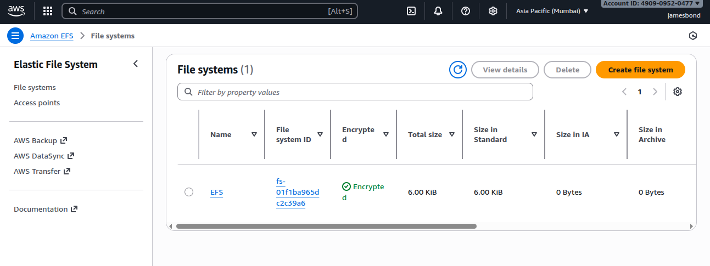
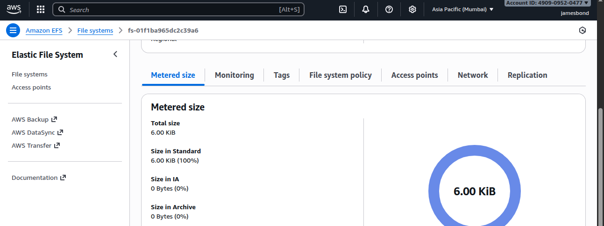
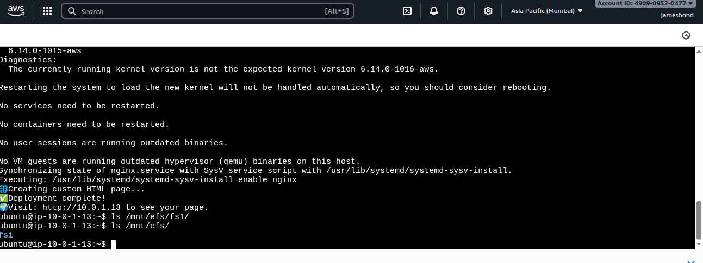
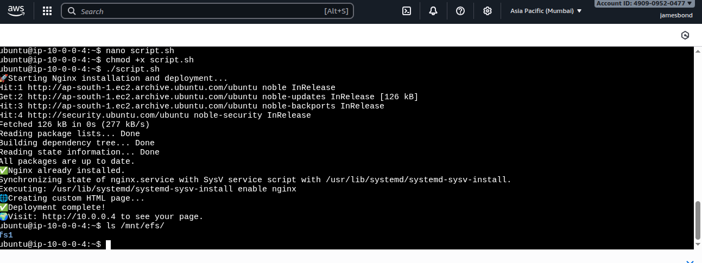
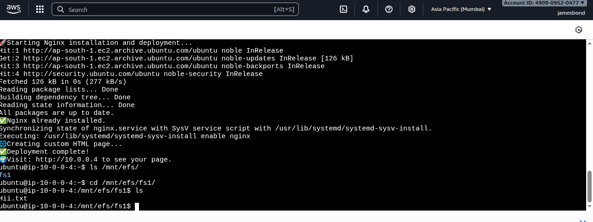
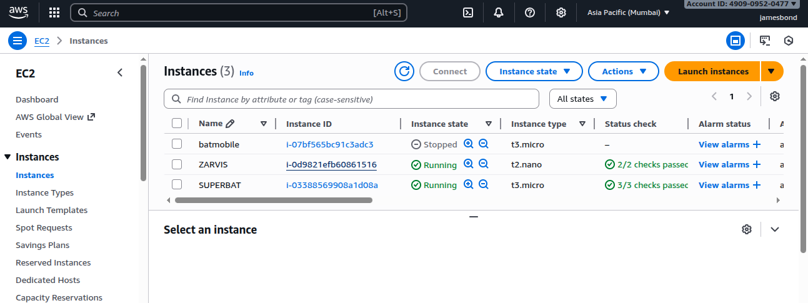
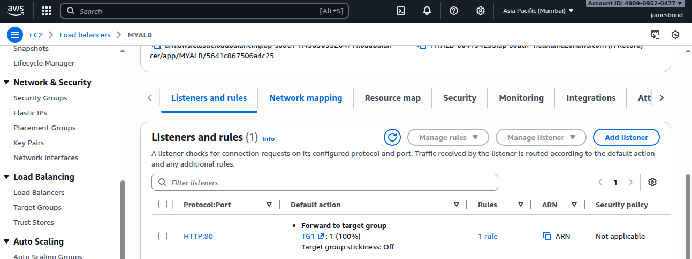
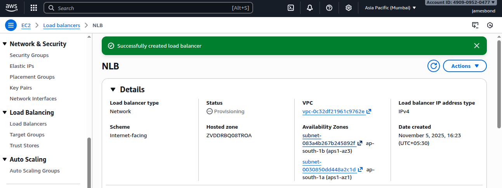
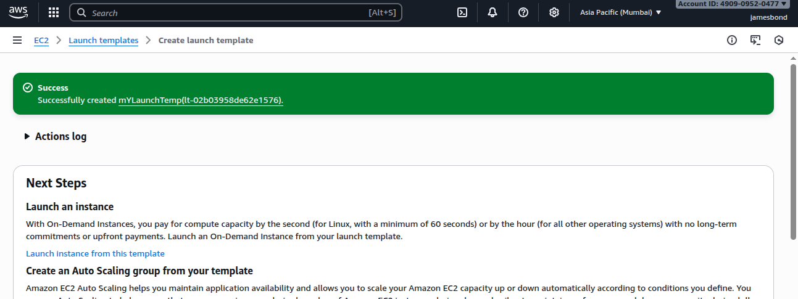
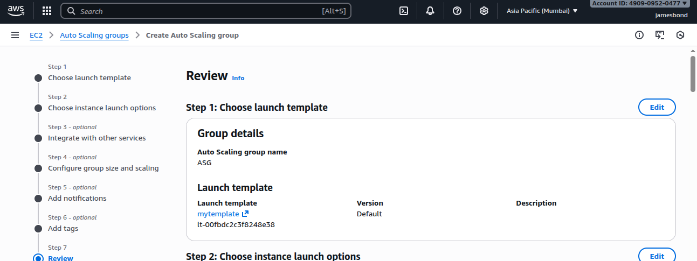

#  AWS Storage, Networking, and Scaling Concepts

This document provides an in-depth overview of key AWS services such as **EBS**, **EFS**, **ENI**, **Load Balancers**, and **Auto Scaling Groups (ASG)** — along with real-world scenarios, scaling strategies, and security configurations.

---

## Amazon EBS (Elastic Block Store)

Amazon **EBS** provides **block-level storage volumes** for use with Amazon EC2 instances.  
It acts like a **virtual hard drive** that stores data persistently, even after instance termination.

###  Key Features

- Persistent block storage for EC2.  
- Automatically replicated within an **Availability Zone (AZ)**.  
- Scalable — increase size, IOPS, or throughput without downtime.  
- Supports **snapshots**, **encryption**, and **multi-attach**.  
- Integrated with **AWS Backup** and **CloudWatch** for monitoring.

---

###  EBS Volume Types

| Type | Description | Best Use Case |
|------|--------------|---------------|
| **gp3 (General Purpose SSD)** | Customizable performance and cost-effective. | Web servers, boot volumes, general workloads. |
| **gp2 (General Purpose SSD)** | Older SSD type (performance tied to size). | General-purpose workloads. |
| **io2 / io2 Block Express (Provisioned IOPS SSD)** | High-performance with low latency and 99.999% durability. | Databases like Oracle, MySQL, SAP. |
| **st1 (Throughput Optimized HDD)** | HDD optimized for high throughput. | Big data, log processing. |
| **sc1 (Cold HDD)** | Lowest-cost HDD for infrequent access. | Backup or archival storage. |

---

### EBS Snapshots

- **Snapshots** are **point-in-time backups** of EBS volumes stored in **S3** (not directly visible).  
- They are **incremental**, saving only the changes since the last snapshot.

**You can:**
- Create new EBS volumes from snapshots.  
- Copy snapshots across regions (for DR).  
- Automate with **Data Lifecycle Manager** or **AWS Backup**.

---

###  EBS Multi-Attach

- Allows a **single EBS volume** to be attached to **multiple EC2 instances** within the **same AZ**.  
- Supported only on **io1/io2** types.  
- Ideal for **clustered databases or shared storage** like Oracle RAC.

---

### Encrypted EBS

- Encryption at **rest**, **in transit**, and in **snapshots** using **AWS KMS**.  
- Automatically encrypts data on the volume and snapshots.  
- Zero performance overhead.

---

## Amazon EFS (Elastic File System)

Amazon **EFS** is a **fully managed, scalable file storage** that can be shared by multiple EC2 instances.

### Key Features
- Provides **file-level storage** accessible via NFS protocol.  
- Automatically grows and shrinks as you add or remove files.  
- Can be **mounted** by multiple instances across multiple AZs.  
- Ideal for **shared applications**, **container storage**, and **serverless** workloads.

that EFS attached to multiple EC2

###  Real-Life Example
A web application running across **multiple EC2 instances** in different AZs stores its images and configuration files in **EFS** so that all servers share the same content directory.

---

##  ENI (Elastic Network Interface)

An **ENI** is a virtual network card for EC2 instances.  
It allows flexible network configurations and multiple IPs per instance.

### Use Cases
- Separate **management and data traffic** on different ENIs.  
- Create **highly available network appliances**.  
- Attach/detach ENIs dynamically for failover or monitoring.

---

## Scalability Concepts

###  Vertical Scaling
- Increasing the size or capacity of a single EC2 instance (e.g., from `t2.micro` → `t2.large`).  
- Simple but limited by hardware capacity.

###  Horizontal Scaling
- Adding more EC2 instances behind a **Load Balancer** for better performance and fault tolerance.  
- Managed automatically using **Auto Scaling Groups (ASG)**.

---

##  Load Balancers (Elastic Load Balancing - ELB)

A **Load Balancer** distributes incoming traffic across multiple EC2 instances to improve performance, reliability, and fault tolerance.

###  Why Use a Load Balancer?

- Distribute load evenly across instances.  
- Expose a **single DNS entry** for your application.  
- Perform **health checks** on backend instances.  
- Provide **SSL termination (HTTPS)**.  
- Support **sticky sessions** for user session persistence.  
- Ensure **high availability** across AZs.  
- Separate **public** and **private** traffic.

---

## Types of Load Balancers

| Type | Layer | Description | Real-Life Scenario |
|------|--------|-------------|--------------------|
| **ALB (Application Load Balancer)** | Layer 7 | Routes traffic based on HTTP/HTTPS headers, host, and path. | Used for microservices or web apps — e.g., `/api` → backend, `/images` → CDN. |
| **NLB (Network Load Balancer)** | Layer 4 | Handles millions of connections per second with low latency. | Financial trading system or gaming backend where TCP/UDP speed matters. |
| **GLB (Gateway Load Balancer)** | Layer 3 | For deploying and scaling third-party network appliances. | Used with firewalls, intrusion detection (IDS/IPS), or deep packet inspection tools. |

---

created an ALB and Target Group

Created an NLB

##  Sticky Sessions (Session Affinity)

Ensures that a user’s session is always routed to the **same backend instance**.  
Used for applications that store user session data locally (e.g., shopping carts).

### How It Works:
- Implemented via **Load Balancer cookies** or **Application cookies**.
- Typically configured at the **ALB** level.

---

## Cross-Zone Load Balancing

Distributes traffic **evenly across all registered instances in all AZs**, not just within one zone.

### Benefits:
- Improves load distribution.  
- Enhances high availability.  
- Prevents overload in a single AZ.

**Example:**  
If AZ-1 has 2 instances and AZ-2 has 4, cross-zone balancing ensures all 6 instances share equal traffic.

---

## SSL Termination

The Load Balancer decrypts **HTTPS (SSL/TLS)** traffic before forwarding it to backend instances.

### Advantages:
- Reduces CPU load on EC2 servers.  
- Centralized SSL certificate management.  
- Simplifies secure communication setup.

**Example:**  
An e-commerce website uses SSL termination at ALB to offload HTTPS encryption from backend servers.

---

## Connection Draining (Deregistration Delay)

When an instance is being **terminated or removed** from the Load Balancer, connection draining allows **in-flight requests to complete** before shutting down.

### Use Case:
- Prevents active user sessions from dropping during scaling operations or updates.

**Example:**  
During a new version deployment, connection draining ensures existing users finish their transactions before instances terminate.

---

##  Auto Scaling Group (ASG)

An **ASG** automatically manages the number of EC2 instances in response to load, failures, or schedules.

### Key Features:
- Launches or terminates EC2 instances automatically.  
- Maintains minimum, maximum, and desired capacity.  
- Integrates with Load Balancers.  
- Performs health checks and replaces failed instances.

---

Create Launch Template First

##  Scaling Policies

Define when and how your ASG scales in or out.

| Type | Description | Example |
|------|--------------|----------|
| **Target Tracking Scaling** | Keeps a metric (like CPU at 60%) around a target value. | Scale out when CPU > 60%. |
| **Step Scaling** | Scales in steps depending on how much the metric exceeds threshold. | +1 instance at 70%, +2 at 90%. |
| **Simple Scaling** | Scales when a single alarm triggers. | Add 1 instance if CPU > 80%. |
| **Scheduled Scaling** | Scales on a fixed schedule. | Add more instances during peak hours (9 AM–6 PM). |

---

## Lifecycle Policies (Instance Lifecycle Hooks)

**Lifecycle policies** allow you to perform **custom actions** when an instance launches or terminates.

### Example:
- Run configuration scripts before an instance becomes active.  
- Backup logs before terminating an instance.

**Use Case:**  
When an instance is about to terminate, a lifecycle hook triggers a Lambda function to archive logs to **S3**.

---

##  Real-World Scenarios Summary

| Scenario | AWS Service | Explanation |
|-----------|--------------|-------------|
| **Dynamic website hosting** | ALB + ASG + EBS | ALB routes traffic to EC2s managed by ASG; EBS stores web data. |
| **Gaming or chat app backend** | NLB + ASG | NLB ensures low latency; ASG adds/removes servers automatically. |
| **Firewall/IDS setup** | Gateway Load Balancer | GLB routes network traffic through security appliances. |
| **Shared web content** | EFS + Multi-AZ EC2 | Multiple EC2s access the same files using EFS. |
| **Graceful app updates** | Connection Draining + Lifecycle Hook | Allows active sessions to complete before updating servers. |
---

** In short:**  
> - **EBS & EFS** = Storage  
> - **ENI** = Networking  
> - **Load Balancers** = Traffic control  
> - **ASG** = Scaling automation  
> Together they create a **resilient, scalable, and fault-tolerant AWS infrastructure.**

## RDS (Relational Database Server)

Amazon Relational Database Service (Amazon RDS) is a managed service offered by Amazon Web Services (AWS) that simplifies the setup, operation, and scaling of relational databases in the cloud.

Amazon RDS Overview
• RDS stands for Relational Database Service
• It’s a managed DB service for DB use SQL as a query language.
• It allows you to create databases in the cloud that are managed by AWS
• Postgres
• MySQL
• MariaDB
• Oracle
• Microsoft SQL Server
• IBM DB2
• Aurora (AWS Proprietary database)

