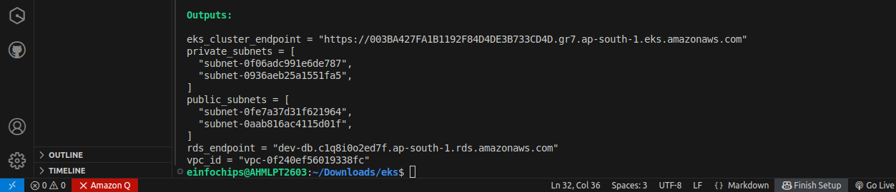
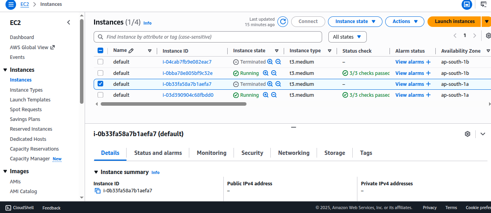
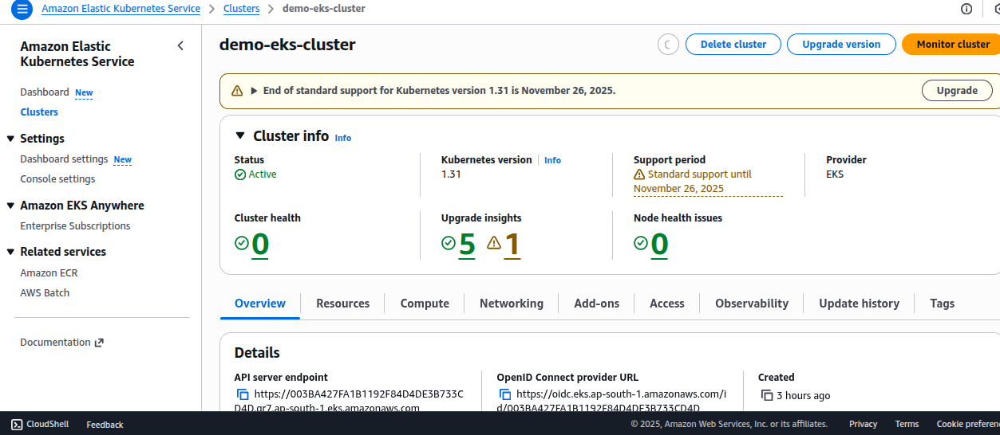
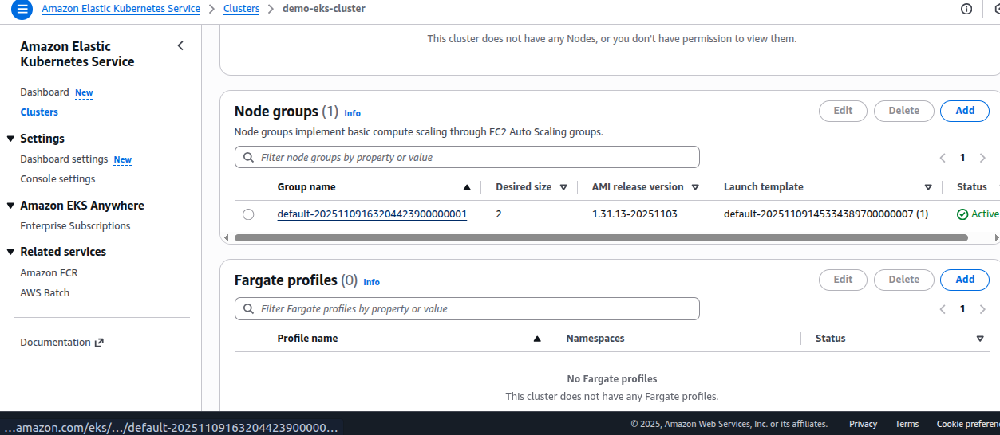
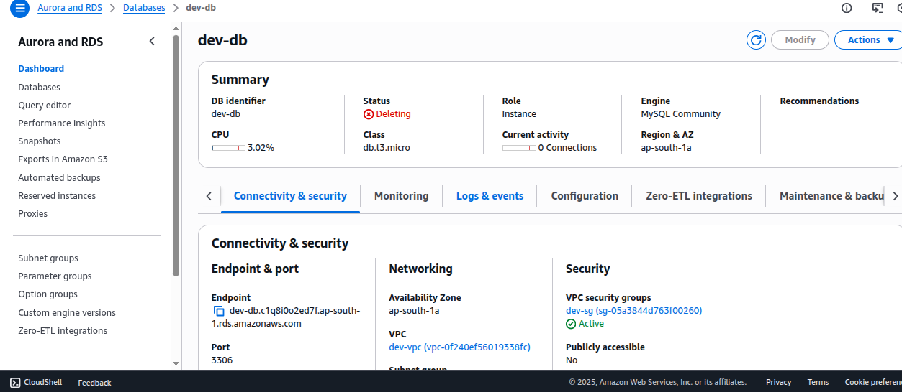
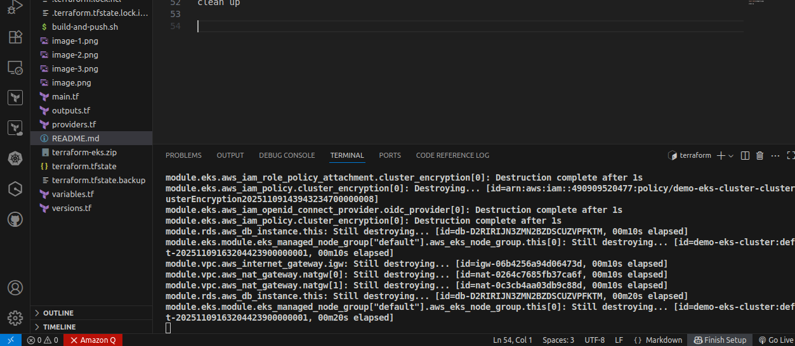

# Terraform EKS 

**What this repo contains**
- Terraform code to provision:
  - VPC with public & private subnets (2 AZs)
  - EKS cluster (using terraform-aws-modules/eks/aws)
  - RDS MySQL instance (private)
- Kubernetes manifests for a simple BookStore microservices app
- Sample app source (book-service Node.js, user-service Flask)
- `variables.tf` is where you should change values (region, cluster name, DB creds, AMI, etc.)

**Important**
- Change `variables.tf` file in the root to set AWS account-specific values before `terraform init` & `apply`.
- This is intended as a learning/demo project. Review resource sizes, security groups, and passwords before running in production.

**How to use**
1. Edit `variables.tf` and set:
   - `aws_region`, `cluster_name`, `vpc_cidr`, `azs`, `db_username`, `db_password`, etc.
2. Initialize and apply Terraform:
   ```bash
   cd terraform-eks
   terraform init
   terraform apply
   ```
3. After apply completes, update kubeconfig:
   ```bash
   aws eks update-kubeconfig --name ${cluster_name} --region ${aws_region}
   kubectl get nodes
   ```
4. Deploy the sample app:
   ```bash
   kubectl apply -f app-deployment/
   ```

**Files**
- `main.tf`, `providers.tf`, `outputs.tf`, `variables.tf`, `versions.tf`
- `modules/vpc/` - VPC module
- `modules/eks/` - EKS uses `terraform-aws-modules/eks/aws`
- `modules/rds/` - RDS instance
- `app-deployment/` - k8s manifests
- `services/` - sample app sources and Dockerfiles













clean up

