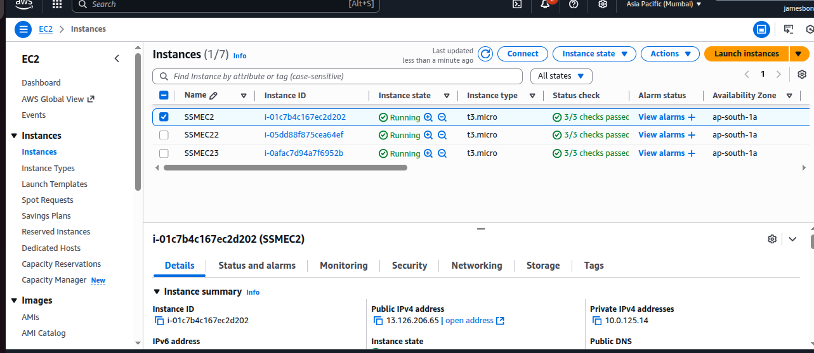
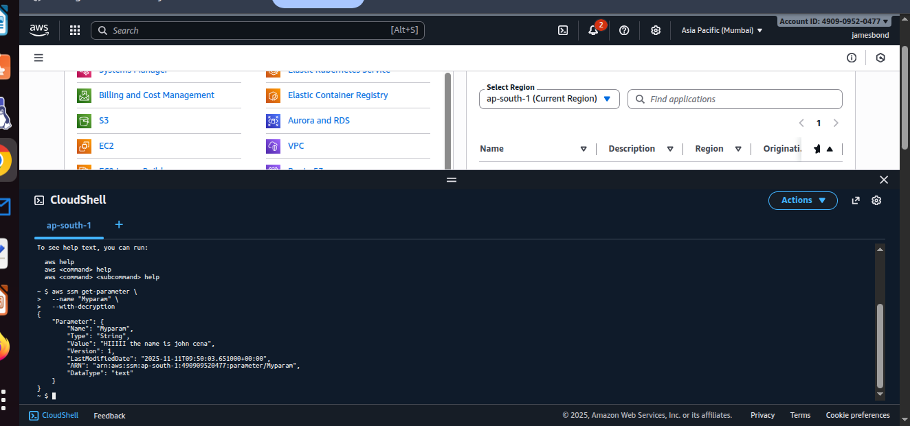
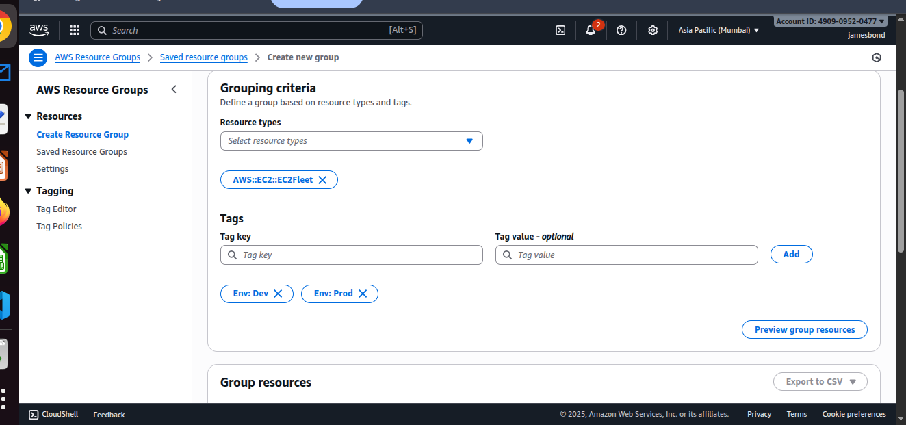
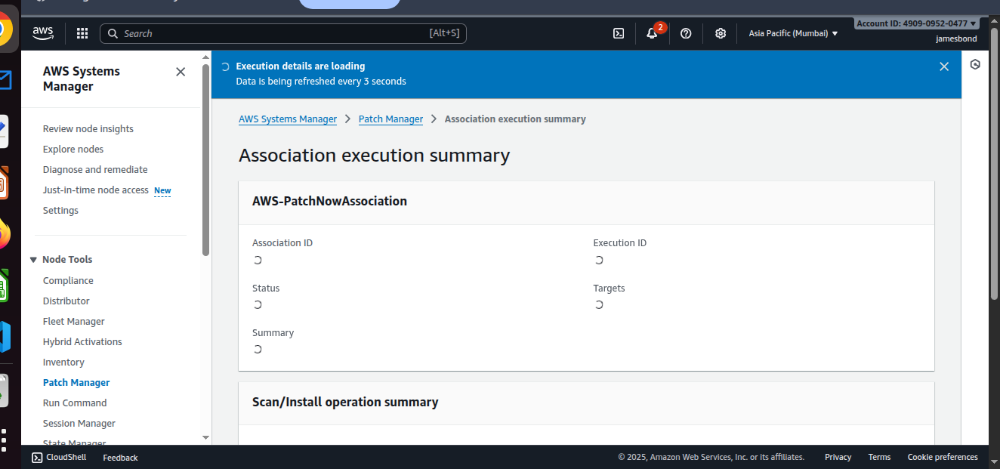
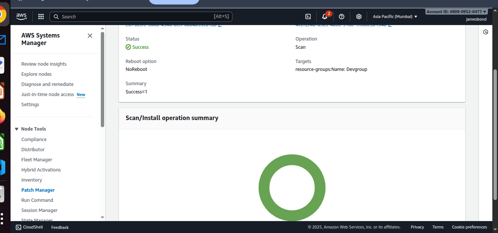
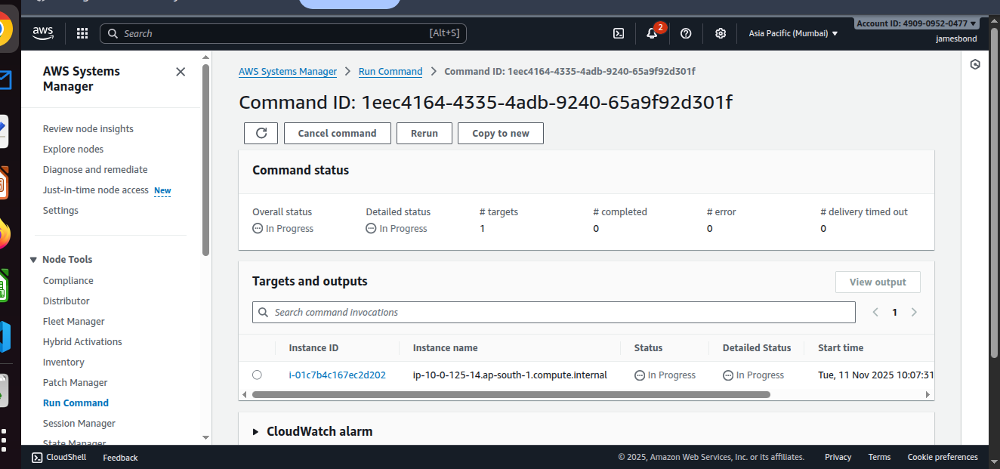
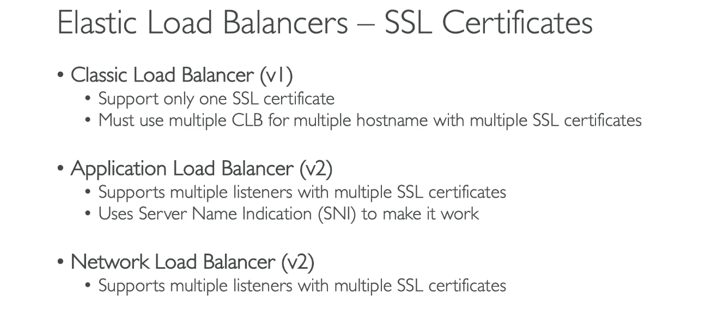

#  AWS Systems Manager (SSM) & CloudFormation Deep Dive

This guide covers key AWS Systems Manager (SSM) concepts, hands-on components, and CloudFormation fundamentals with practical examples and commands.

---



## What Are SSM Parameters?

**SSM Parameters** are essentially **key–value pairs** stored securely in AWS Systems Manager Parameter Store.

They are used to store:
- Application configuration values (e.g., `DB_HOST`, `API_URL`)
- Secrets or credentials (e.g., passwords, tokens)
- Environment variables for EC2, Lambda, or ECS

### Example Use Case
A company runs a web application with **dev**, **staging**, and **prod** environments — each with different database credentials.

Instead of hardcoding credentials, they use **SSM Parameter Store**.

```bash
# Store a parameter
aws ssm put-parameter   --name "/myapp/dev/db_password"   --value "mysecretpassword"   --type SecureString

# Retrieve a parameter
aws ssm get-parameter   --name "/myapp/dev/db_password"   --with-decryption
```

---

##  Resource Groups

Resource Groups allow logical grouping of AWS resources for easier management and automation within Systems Manager.



resource group 



---

##  Host Management – Hands-on Topics

###  SSM Documents & Automation
**SSM Document = The “Instructions”**

An **SSM document** defines a series of steps (in JSON or YAML) that Systems Manager executes.

You can use it to:
- Run shell or PowerShell commands  
- Install or patch software  
- Create AMIs  
- Manage AWS resources automatically  

---





RUn command




SSM session manager


##  SSM Inventory and State Manager

### **SSM Inventory**
Collects and stores detailed configuration data from EC2/on-prem instances.

**You can answer:**
- What software is installed?
- Which OS versions are running?
- Which instances have a certain patch?

Think of Inventory as a **central database** of instance configuration details.

---

## 🔧 SSM Patch Manager

**AWS Systems Manager Patch Manager** automates the patching of EC2 instances and on-prem servers for OS and apps.

###  Why Use Patch Manager?
| Traditional Admin Tasks | Patch Manager Benefits |
| ------------------------ | ---------------------- |
| SSH/RDP into servers | No SSH/RDP needed |
| Run manual updates | Automated patching |
| Track via spreadsheets | Fully logged & auditable |
| Risk of human error | Repeatable & safe |

###  Maintenance Windows

You can schedule patches only during approved windows.

**Example:** Every Sunday at 2 AM  
Only patch instances tagged `PatchGroup=Prod`.

```text
Systems Manager → Maintenance Windows → Create maintenance window
```

| Field | Example |
| ------ | -------- |
| Name | Sunday-Patching |
| Schedule | `cron(0 2 ? * SUN *)` |
| Duration | 2 hours |
| Stop initiating after | 1 hour |

`cron(0 2 ? * SUN *)` = Every Sunday at 2:00 AM UTC

### Key Terms
- **Patch Baseline:** Defines approved/rejected patches  
- **Patch Group:** Logical EC2 instance grouping (via tags)  
- **Maintenance Window:** Defines patch schedule  

---

##  Run Command

Run shell or PowerShell commands on multiple instances simultaneously — securely and without SSH.

---

##  SSM Session Manager

Start secure shell sessions to EC2 instances **without opening port 22 (SSH)** or 3389 (RDP).  
All activity is logged in **CloudWatch Logs** or **S3** for auditing.

---

##  Elastic Load Balancing (ELB) Concepts

###  Connection Draining
Gracefully complete in-flight requests before removing instances from the load balancer.

###  Sticky Sessions
Ensures user requests are consistently routed to the same backend instance.

#### Application Load Balancer (ALB)
- Uses cookies (`AWSALB`)
- Default duration: 1 minute (configurable up to 7 days)

#### Network Load Balancer (NLB)
- Uses **Source IP Affinity**
- Works at Layer 4 (TCP)
- Great for UDP/TCP workloads (gaming, VoIP)

---

##  SSL/TLS Certificates in ELB

Enables encrypted communication between clients and load balancers.



---

## CloudFormation Overview

CloudFormation automates resource creation using templates.

| Section | Purpose |
| -------- | -------- |
| **1. AWSTemplateFormatVersion** | Template version |
| **2. Description** | Human-readable description |
| **3. Metadata** | Extra info for tools |
| **4. Parameters** | User inputs for customization |
| **5. Mappings** | Static key–value lookups |
| **6. Conditions** | Logic to control resource creation |
| **7. Resources** | AWS resources (core of template) |
| **8. Outputs** | Values returned after creation |

---

##  Outputs & Exports

Exports share outputs between stacks.

```yaml
Outputs:
  VPCId:
    Description: The ID of the VPC
    Value: !Ref MyVPC
    Export:
      Name: MyApp-VPCID

  PublicSubnet:
    Description: Public subnet ID
    Value: !Ref PublicSubnet
    Export:
      Name: MyApp-PublicSubnet
```

Use in another stack:
```yaml
Resources:
  MyInstance:
    Type: AWS::EC2::Instance
    Properties:
      SubnetId: !ImportValue MyApp-PublicSubnet
```

---

##  Conditions

Control resource creation using logic:

```yaml
Conditions:
  CreateProdResources: !Equals [!Ref Environment, "Prod"]

Resources:
  ProdS3Bucket:
    Type: AWS::S3::Bucket
    Condition: CreateProdResources
```

---

##  Intrinsic Functions

| Function | Purpose |
| -------- | -------- |
| `!Ref` | Reference a parameter/resource |
| `!GetAtt` | Get resource attributes (e.g., ARN, DNS) |
| `!Sub` | Substitute variables in strings |
| `!Join` | Join strings |
| `!If`, `!Equals`, `!Not`, `!And`, `!Or` | Logical operations |

---

## Rollbacks & Stack Policies

- **Rollback:** Automatically reverts stack changes on failure  
- **Stack Policy:** Protects resources from accidental updates  
- **Termination Protection:** Prevents full stack deletion  

---

## Deletion & Update Policies

```yaml
Resources:
  MyDB:
    Type: AWS::RDS::DBInstance
    DeletionPolicy: Snapshot
    UpdateReplacePolicy: Retain
```

- `Delete` (default): Resource is deleted  
- `Retain`: Keeps resource  
- `Snapshot`: Creates snapshot before deletion  

---

## Dynamic References

Securely fetch values from SSM or Secrets Manager:

```yaml
DBPassword: {{resolve:ssm-secure:MyDBPassword:1}}
DBPassword: {{resolve:secretsmanager:mySecret:SecretString:password}}
```

---

##  CloudFormation UserData Example

```yaml
Resources:
  MyEC2:
    Type: AWS::EC2::Instance
    Properties:
      ImageId: ami-0abcd1234
      InstanceType: t2.micro
      UserData:
        Fn::Base64: !Sub |
          #!/bin/bash
          yum update -y
          yum install -y httpd
          systemctl enable httpd
          systemctl start httpd
```

---

##  Nested Stacks

Nested stacks = reusable **modules** in CloudFormation.

```yaml
Resources:
  VPCStack:
    Type: AWS::CloudFormation::Stack
    Properties:
      TemplateURL: https://s3.amazonaws.com/mybucket/templates/vpc.yml

  SecurityStack:
    Type: AWS::CloudFormation::Stack
    Properties:
      TemplateURL: https://s3.amazonaws.com/mybucket/templates/security.yml
```

---

##  DependsOn Example

```yaml
Resources:
  MyBucket:
    Type: AWS::S3::Bucket

  MyBucketPolicy:
    Type: AWS::S3::BucketPolicy
    DependsOn: MyBucket
```

---

## StackSets

Deploy CloudFormation stacks across multiple AWS **accounts** and **regions**.

Common Warnings:
- Missing IAM admin/execution roles  
- Drift across regions  
- Slow propagation  
- Stack quotas  

---

##  Drift Detection

**Drift** = actual AWS resource state ≠ CloudFormation template.

Use drift detection to identify and reconcile differences.

---

##  Troubleshooting

| Step | Tool |
| ---- | ---- |
| View errors | **Events tab** |
| Check logs | `/var/log/cfn-init.log`, `/var/log/cloud-init.log` |
| Validate | `aws cloudformation validate-template` |
| IAM issues | Verify permissions |
| Preview updates | Use **Change Sets** |
| Stack stuck | Use **Disable Rollback** |
| Detect drift | Compare actual vs expected |
