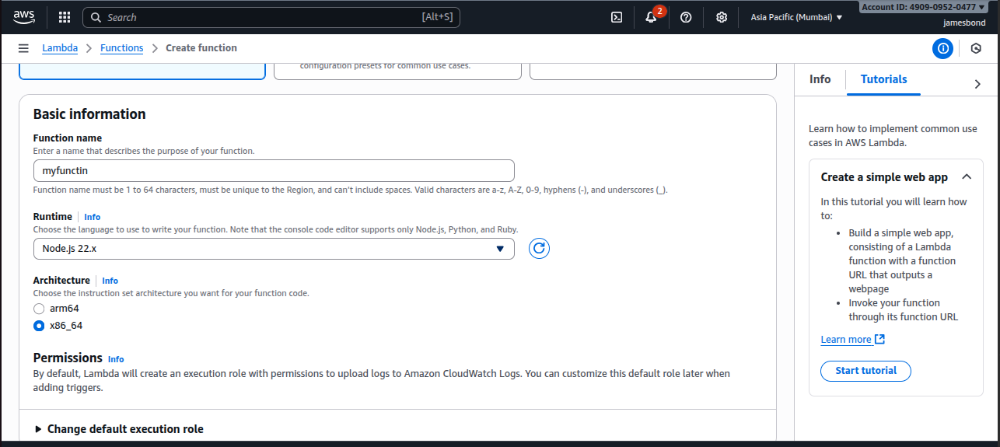
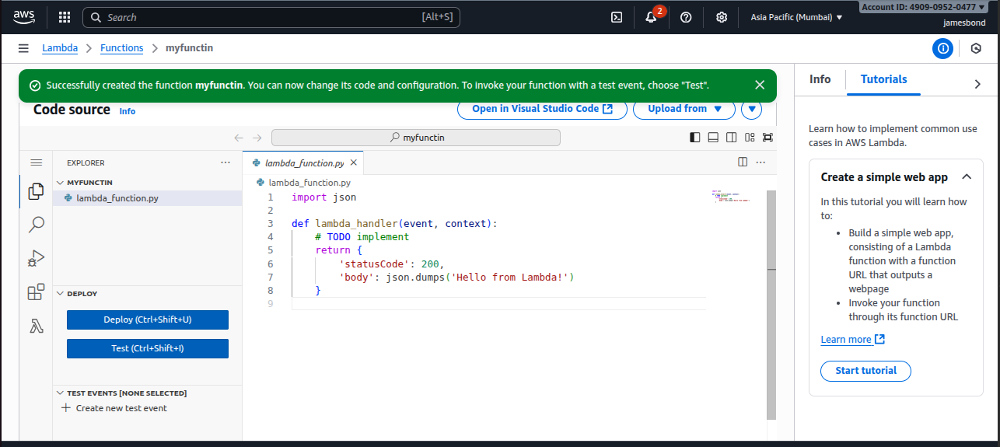
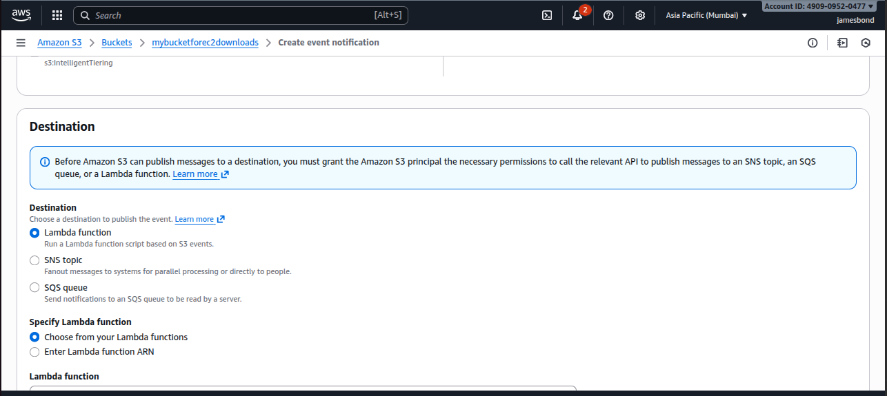
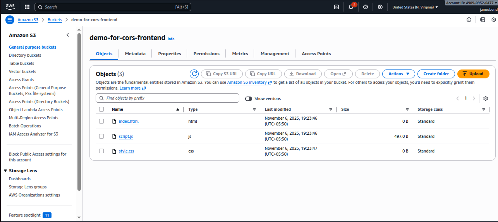
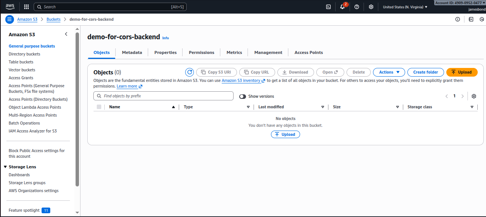
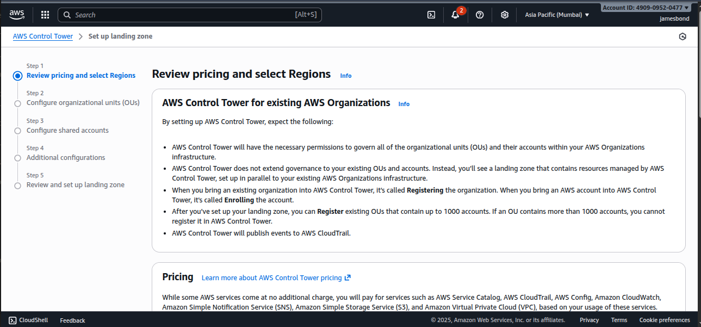
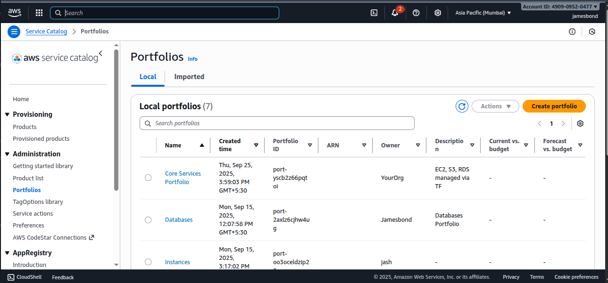

------------------------------------------------------------------------
## AWS Lambda 




## AWS Lambda + CloudWatch Scenario

**Goal:** Automatically restart an EC2 instance when it stops.

###  Steps:

1.  Create a **CloudWatch Rule** for the EC2 "stopped" state.
2.  Configure the rule to trigger a **Lambda function**.
3.  The Lambda function will call the **StartInstances API** using
    boto3.

**Example Use Case:**\
Automatically restart critical EC2 instances if they stop unexpectedly.

------------------------------------------------------------------------

## EventBridge

**Goal:** Run Lambda on a schedule or custom event.

### Example:

-   **Use Case:** Every day at midnight, clean up old S3 files.

### Steps:

1.  Go to **Amazon EventBridge → Rules → Create Rule**.
2.  Choose **Schedule pattern** (cron or rate).
3.  Set target as **Lambda function**.
4.  Test by verifying logs in CloudWatch.

------------------------------------------------------------------------

## Lambda S3 Event Notification

**Goal:** Automatically trigger a Lambda function when a file is
uploaded or deleted in S3.

###  Steps:

1.  Go to **S3 → Properties → Event Notifications**.
2.  Add event for **ObjectCreated** or **ObjectRemoved**.
3.  Set destination as your **Lambda function**.
4.  Grant permission to S3 to invoke Lambda.



------------------------------------------------------------------------

## S3 Replication

**Goal:** Automatically replicate objects between buckets.

### Types:

-   **Cross-Region Replication (CRR)** → between different regions.\
-   **Same-Region Replication (SRR)** → within the same region.



### 🔧 Steps:

1.  Enable **Versioning** on both **source** and **destination**
    buckets.
2.  Go to **Management → Replication → Create Rule**.
3.  Choose destination bucket, IAM role, and save.

------------------------------------------------------------------------

## S3 Multipart Upload & S3 Transfer Acceleration

### **Multipart Upload**

-   Used for **large files (\>100MB)**.
-   Splits a file into multiple parts and uploads in parallel for speed
    and reliability.

### **Transfer Acceleration**

-   Speeds up uploads/downloads using **CloudFront edge locations**.

-   Use accelerated endpoint:

    ``` bash
    https://mybucket.s3-accelerate.amazonaws.com
    ```

------------------------------------------------------------------------

##  S3 Batch Operations

**Goal:** Perform operations (like copying, tagging, or invoking Lambda)
on millions of objects.

### Example Use Case:

Add metadata to all objects in an S3 bucket.

------------------------------------------------------------------------

## S3 Inventory

**Purpose:** Generate a CSV/Parquet report of all objects and metadata
(size, storage class, encryption, etc.).

###  Steps:

1.  Go to **S3 → Management → Inventory → Create Inventory**.
2.  Choose destination bucket and output format (CSV or Parquet).
3.  Wait for the scheduled report.

**Use Case:** Compliance, auditing, and analytics.

------------------------------------------------------------------------

## Athena

**Purpose:** Query data directly in S3 using SQL (no database needed).

###  Steps:

1.  Go to **Athena Console**.
2.  Set **query result location** in S3.
3.  Create table (for example, for S3 access logs).
4.  Run SQL queries to analyze data.

------------------------------------------------------------------------

##  S3 Access Logs

**Purpose:** Track every access request to your S3 bucket.

###  Hands-on Steps:

1.  Go to **S3 → Properties → Server Access Logging**.
2.  Enable logging → Choose target bucket.
3.  Logs will appear in the target bucket under `/logs/`.

**Use Case:** Security, audit, and analytics.

------------------------------------------------------------------------

##  Glacier Vault

**Purpose:** Store long-term archival data at very low cost.

### Types:

-   **Glacier Instant Retrieval**\
-   **Glacier Flexible Retrieval**\
-   **Glacier Deep Archive**

**Use Case:** Backup, compliance, and data retention.

------------------------------------------------------------------------

##  S3 VPC Endpoints

**Goal:** Connect to S3 privately from a VPC without using the internet.

### Types:

-   **Gateway Endpoint** (for S3 and DynamoDB)
-   **Interface Endpoint** (for other services)

###  Steps:

1.  Go to **VPC → Endpoints → Create Endpoint**.
2.  Select service: `com.amazonaws.<region>.s3`
3.  Choose your **VPC** and **route tables**.
4.  Add **policy** to allow full S3 access.

------------------------------------------------------------------------

##  FSx

**Purpose:** Fully managed shared file storage for Windows and Lustre.
FSx = “Managed file systems for specific workloads.”

Amazon FSx is a fully managed file storage service that provides high-performance, scalable, and cost-efficient file systems on AWS — all accessible via standard file protocols (like SMB, Lustre, or NFS).

It removes the need to manually deploy, patch, scale, and back up file servers, letting you focus on your applications instead of file system administration.


### Types:

-   **FSx for Windows File Server** → SMB protocol support.
-   **FSx for Lustre** → High-performance file system for compute
    workloads.

------------------------------------------------------------------------
## Storage Gateway

Bridge between on premises database and cloud data

| Type                 | Interface   | Backed by              | Use Case                                   |
| -------------------- | ----------- | ---------------------- | ------------------------------------------ |
| **File Gateway**     | NFS / SMB   | Amazon S3              | Store and access files as S3 objects       |
| **Volume Gateway**   | iSCSI       | EBS Snapshots          | Backup block storage (databases, VMs)      |
| **Tape Gateway**     | iSCSI (VTL) | S3 / Glacier           | Replace physical tape libraries for backup |
| **FSx File Gateway** | SMB         | Amazon FSx for Windows | Extend FSx storage to on-premises          |


# AWS Services Detailed Overview

This document provides an in-depth explanation of several AWS services, along with practical examples and use cases.

---

##  AWS Storage Gateway

**Purpose:** Hybrid cloud storage service that connects on-premises environments to AWS Cloud storage.

**Types:**
- **File Gateway:** Stores files as objects in S3.
- **Volume Gateway:** Provides cloud-backed iSCSI block storage.
- **Tape Gateway:** Replaces physical tape libraries with virtual tapes stored in S3 or Glacier.

**Scenario:**  
A company with local servers wants to back up its data to AWS but still access it locally. They use **File Gateway**, which stores files locally and asynchronously uploads them to **Amazon S3**.

---

##  Amazon CloudFront with S3

**Purpose:** A Content Delivery Network (CDN) that delivers data globally with low latency by caching content at edge locations.

**Use Case Example:**  
Host static website content (HTML, CSS, JS, images) in **S3**, and distribute globally using **CloudFront**.

**Steps:**
1. Upload your website files to an S3 bucket.
2. Create a CloudFront distribution with the S3 bucket as the origin.
3. Use the CloudFront URL for faster global content delivery.

---

##  CloudFront Caching & Invalidation

**Caching:** CloudFront caches content at edge locations to improve performance and reduce load on the origin.

**Invalidation:** Used to remove cached objects before they expire.

**Example:**  
If you update an image on your website, you can invalidate it:
```bash
aws cloudfront create-invalidation --distribution-id E1234567890 --paths "/images/logo.png"
```

---

##  Geo Restriction (CloudFront)

**Purpose:** Restrict access to your content based on the viewer’s country.

**Example Scenario:**  
You want to block users from certain countries due to licensing restrictions.  
You can configure Geo Restriction in the CloudFront distribution settings to **allow or block** specific countries.

---

## Caching Deep Dive

CloudFront uses multiple caching layers:
1. **Edge Cache:** Closest to the viewer.
2. **Regional Edge Cache:** Aggregates requests from multiple edges.
3. **Origin Cache (S3, EC2, etc.)**

**Cache Behavior Settings:**
- TTL (Time To Live)
- Cache based on headers, query strings, and cookies.

---

## AWS Global Accelerator

**Purpose:** Improves availability and performance of your global applications by routing traffic through the AWS global network.

**Scenario:**  
An application hosted in multiple AWS regions uses **Global Accelerator** to automatically route users to the nearest healthy endpoint for minimal latency.

---

## Amazon EventBridge

**Purpose:** Event-driven architecture that connects AWS services and custom applications.

**Key Features:**
- **Event Pipes:** Simplify data flow between sources and targets (e.g., SQS to Lambda).
- **Retries:** Automatically retries failed events.
- **Dead Letter Queues (DLQs):** Capture events that fail processing.

**Example:**  
A Lambda function processes S3 upload events via EventBridge. If the function fails, the event is sent to an SQS DLQ.

---

## AWS Config

**Purpose:** Continuously monitors and records AWS resource configurations to ensure compliance and auditing.

**Use Case:**  
Track if all S3 buckets have encryption enabled and trigger alerts if any are non-compliant.

---

## AWS Control Tower

**Purpose:** Simplifies setup and governance of a secure, multi-account AWS environment.
AWS Control Tower is a managed service that helps you set up, govern, and manage a secure multi-account AWS environment based on AWS best practices — automatically.

**Features:**
- Preconfigured security and compliance guardrails.
- Automated account provisioning using AWS Organizations.


---

## AWS Service Catalog

**Purpose:** Allows organizations to create and manage approved collections of AWS resources.

**Example:**  
IT admins can offer a catalog of pre-approved EC2 or RDS configurations that developers can deploy safely.


---

## AWS DataSync

**Purpose:** Automates data transfer between on-premises storage and AWS (S3, EFS, FSx).

**Scenario:**  
A company migrates 100TB of on-premise NAS data to **Amazon S3** using DataSync to reduce manual effort and ensure fast transfer.

---

## AWS Backup

**Purpose:** Centralized backup service for AWS and on-premises data.

**Supports:** EC2, EBS, RDS, DynamoDB, EFS, and more.

**Scenario:**  
Set up a daily backup plan for RDS databases and EC2 instances to meet compliance requirements.

---

##  AWS WAF, Shield & Firewall Manager

### AWS WAF (Web Application Firewall)
Protects web applications from common web exploits (e.g., SQL injection, XSS).

### AWS Shield
Provides DDoS protection:
- **Standard:** Free automatic protection.
- **Advanced:** Enhanced DDoS protection with cost protection.

### AWS Firewall Manager
Central management tool for WAF and Shield policies across multiple accounts.

**Example:**  
A global web app uses **Shield Advanced** for DDoS protection and **WAF** for custom blocking rules (e.g., block IPs or countries).

---

##  AWS X-Ray

**Purpose:** Traces requests through your distributed application to analyze performance issues.

**Scenario:**  
Identify slow API endpoints in a microservices architecture by using X-Ray integrated with Lambda and API Gateway.

---

##  Amazon SQS (Simple Queue Service)

**Purpose:** Fully managed message queuing service for decoupling microservices.

**Features:**
- Standard and FIFO queues.
- Dead Letter Queues.
- Message retention and visibility timeout.

**Scenario:**  
Orders placed on an e-commerce site are queued in **SQS** before being processed by backend workers.

---

## Amazon Managed Service for Prometheus and Grafana

**Amazon Managed Prometheus:** Collects and stores metrics data for containerized workloads (EKS, ECS).  
**Amazon Managed Grafana:** Visualizes the metrics collected by Prometheus.

**Scenario:**  
Monitor CPU and memory usage in an **EKS cluster** using Prometheus and visualize dashboards in Grafana.

