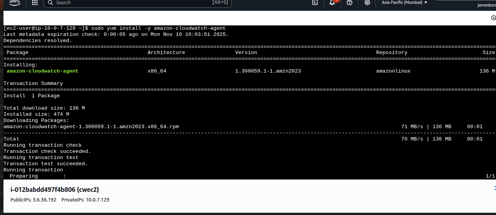
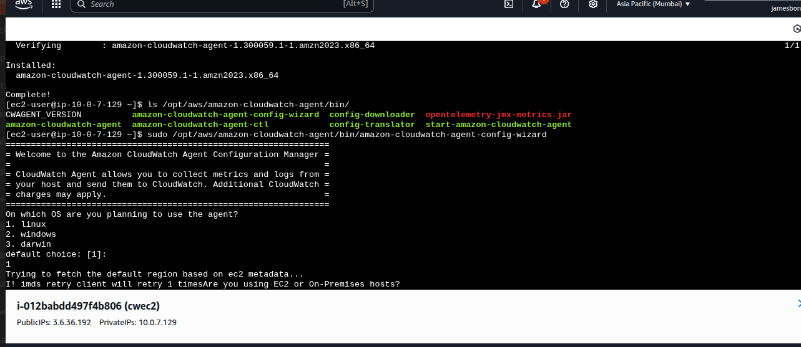
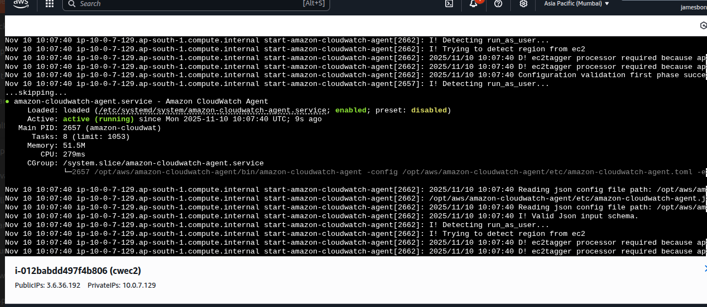

**EC2 Instance Connect Endpoint**, **CloudWatch Unified Agent**, **EC2 Scheduler**, **No Reboot AMI updates**, **Cross-Account AMI Sharing**, and **EC2 Image Builder**.

---

## 1. EC2 Instance Connect Endpoint (EIC Endpoint) Status Checks

The EIC Endpoint allows you to connect to an EC2 instance privately using SSH/RDP without requiring a public IP address.

* **Endpoint Status:** Verify the status is `Available`. If not, connection attempts will fail.
    ```bash
    aws ec2 describe-instance-connect-endpoints --instance-connect-endpoint-ids <eice-id> --query "InstanceConnectEndpoints[].State"
    ```
* **Security Groups:** Ensure the EIC Endpoint's Security Group allows **inbound traffic** from your **connecting client's IP range** on the appropriate port (usually **TCP 22 for SSH**).
* **Networking:** Confirm the associated **Subnet** has an active **Private DNS hostname** and is correctly routed to the target instance's VPC.
* **IAM Permissions:** The connecting IAM Principal must have the necessary permissions (`ec2:DescribeInstanceConnectEndpoints`, `ec2-instance-connect:SendSSHPublicKey`).

---

## 2. CloudWatch Unified Agent Installation & Status Steps

The CloudWatch Unified Agent is used to collect metrics, logs, and traces from your EC2 instances and on-premises servers.

### Installation & Configuration
1.  **IAM Role:** Attach an IAM Role with the `CloudWatchAgentServerPolicy` to the target EC2 instance.


2.  **Download:** Download the agent installer package onto the instance.

3.  **Configuration:** Create a configuration file (`config.json`) using the **CloudWatch Agent Configuration Wizard** or manually define the metrics/logs to collect.

4.  **Start Agent:** Start the agent using the configuration file path.
    ```bash
    # On Linux
    /opt/aws/amazon-cloudwatch-agent/bin/amazon-cloudwatch-agent-ctl -a fetch-config -m ec2 -c file:/path/to/config.json -s




### Status Checks
* **Agent Status:** Check if the agent is running correctly.
    ```bash
    # On Linux
    /opt/aws/amazon-cloudwatch-agent/bin/amazon-cloudwatch-agent-ctl -m ec2 -a status
    ```
* **Logs:** Review the agent logs for errors.
    * **Linux:** `/opt/aws/amazon-cloudwatch-agent/logs/amazon-cloudwatch-agent.log`
    * **Windows:** `%ProgramData%\Amazon\AmazonCloudWatchAgent\Logs\amazon-cloudwatch-agent.log`
* **CloudWatch Console:** Verify that the expected custom **Metrics** and **Log Groups** are appearing in the AWS CloudWatch Console.


---




## 3. EC2 Scheduler

The EC2 Scheduler is a solution (often deployed via a CloudFormation template) that helps reduce costs by automatically starting and stopping EC2 instances based on a customizable schedule and tags.

* **Core Components:** Typically uses **Lambda**, **DynamoDB** (for configuration), and **CloudWatch Events/EventBridge** (for scheduling).
* **Configuration:** Instances are scheduled by applying specific **tags** (e.g., `Schedule: office-hours`) that correspond to a defined schedule in the DynamoDB table.
* **Verification:**
    1.  Check the **DynamoDB table** to ensure your defined schedules are present and correct.
    2.  Verify the EC2 instances have the correct **scheduling tag** applied.
    3.  Monitor the **Lambda function logs** for any execution errors during scheduled start/stop times.


---

## 4. AMI No Reboot Option (SSM Automation)

When applying patches or configuration updates to a running EC2 instance that *doesn't* require a full system reboot, you can often capture a new **AMI (Amazon Machine Image)** without stopping or rebooting the instance.

* **AWS CLI Option:** Use the `--no-reboot` flag with the `create-image` command.
    ```bash
    aws ec2 create-image --instance-id i-xxxxxxxxxxxxxxxxx --name "My-AMI-Update-$(date +%F)" --no-reboot
    ```
* **Caveat:** The no-reboot option relies on the file system being in a consistent state. If the instance is under heavy write load, the AMI **might not be completely consistent**. It is generally safer to use this option for minor configuration changes rather than major system updates.
* **Best Practice:** For production workloads and critical systems, a brief outage (stop/reboot) is often recommended to ensure data integrity in the resulting AMI.

---

## 5. Cross-Account AMI Sharing

Sharing an AMI securely between different AWS accounts is a common requirement for multi-account environments.

### Steps for Sharing (Source Account)
1.  **Select AMI:** Locate the desired AMI in the EC2 Console or via CLI.
2.  **Modify Permissions:** Change the AMI launch permissions to allow the target AWS Account ID.
    ```bash
    aws ec2 modify-image-attribute --image-id ami-xxxxxxxxxxxxxxxxx --launch-permission "Add=[{UserId=123456789012}]"
    ```

### Steps for Using (Target Account)
1.  **Accept:** The AMI is now automatically visible under **Private Images** in the EC2 console of the target account. No explicit "acceptance" is required.
2.  **Launch:** The target account can now launch EC2 instances using the shared AMI, provided the source account does **not** de-register or modify the AMI permissions.

---

## 6. EC2 Image Builder

EC2 Image Builder is a fully managed AWS service that automates the creation, management, and deployment of customized, secure, and up-to-date **AMIs** and **container images**.

* **Key Concepts:**
    * **Image Pipeline:** The automated workflow that creates the image.
    * **Image Recipe:** Defines the base image (source AMI) and the components (configuration/scripts) to apply.
    * **Component:** Defines the steps for installation, configuration, and testing (e.g., install specific software, patch OS).
    * **Distribution Settings:** Defines where and how the resulting image is distributed (e.g., shared with specific accounts, copied to different regions).
* **Benefit:** Enforces **security standards** (using AWS-managed components or custom security checks) and maintains **version control** for infrastructure as code.
* **Trigger:** Pipelines can be triggered manually, on a set schedule, or when the source AMI is updated.

Example Use Case

A company runs hundreds of EC2 instances. They want all instances to have:

Nginx installed

Security patches applied weekly

Company-specific monitoring tools

Instead of manually updating each instance:

They create an Image Builder pipeline.

Define base AMI → add software → run tests → output new AMI.

Use the new AMI to launch all EC2 instances.

Result: consistent, secure, and up-to-date servers automatically.


AWS sytems manager

# AWS Systems Manager 
## is a unified service that helps you view, control, automate, and manage your AWS infrastructure securely at scale.

Think of it as a control center for managing EC2 instances, on-premises servers, and other AWS resources — all from one central dashboard.

it’s designed to:

Automate operational tasks
Collect system information
Apply updates or patches
Execute commands remotely
Manage configurations
Ensure compliance and security
