# Docker Basics – Complete Guide

## Show Disk Usage by Docker
```bash
docker system df
```
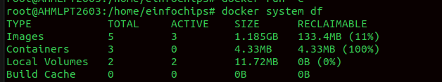

---

## Tagging the Images
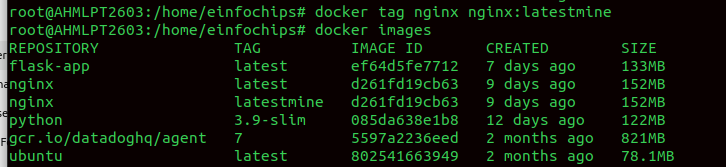

---

## Docker Images History
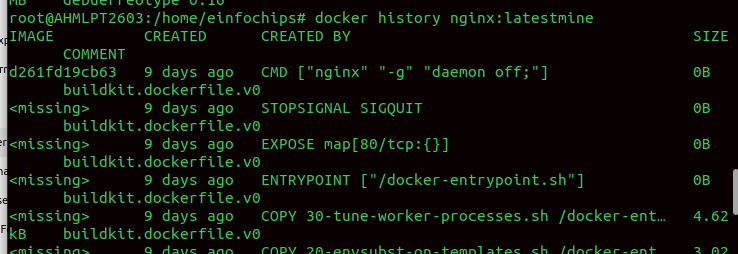

---

## Save Image to Tar File
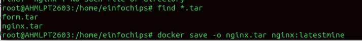

---

## Load Image from Tar File
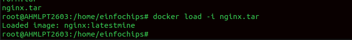

---

## Containers

### Run Container Interactively
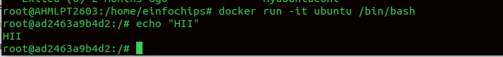

### Run Container in Background
### Giving a Name to the Container


### Killing the Container
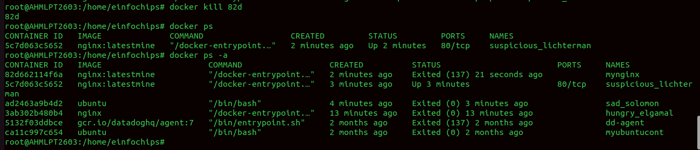

### Removing the Container


### Run Commands Inside Containers


---

## Docker Inspect

The `docker inspect` command is one of the most powerful and useful Docker CLI commands — it lets you view detailed, low-level information about Docker objects such as containers, images, networks, and volumes.

You can use it to:

- Check container IP addresses and mounts  
- View environment variables  
- See image layers  
- Inspect volume paths  
- Retrieve network configurations  
- Debug containers

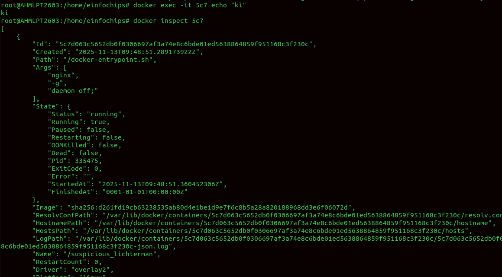

---

## Docker Logs
```bash
docker logs <container_name>
```
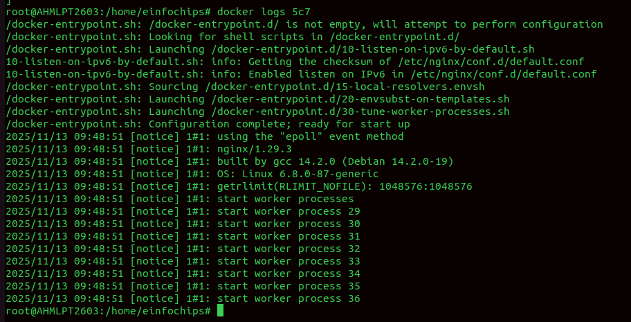

---

## Container Processes
```bash
docker top <container_id>
```
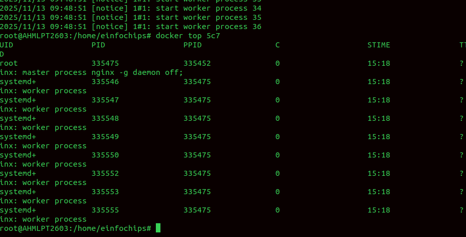

---

## Import and Prune Images
```bash
docker import file.tar
docker image prune
```

---

## Docker Networks

| Command | Description | Example |
|----------|--------------|----------|
| `docker network ls` | List all networks | `docker network ls` |
| `docker network inspect <network>` | Inspect network details | `docker network inspect bridge` |
| `docker network create <name>` | Create a custom network | `docker network create mynet` |
| `docker network rm <name>` | Remove a network | `docker network rm mynet` |
| `docker network connect <net> <container>` | Connect container to a network | `docker network connect mynet webapp` |
| `docker network disconnect <net> <container>` | Disconnect from network | `docker network disconnect mynet webapp` |

---

## Docker Volumes

| Command | Description | Example |
|----------|--------------|----------|
| `docker volume ls` | List volumes | `docker volume ls` |
| `docker volume create <name>` | Create a new volume | `docker volume create data_vol` |
| `docker volume inspect <name>` | Inspect a volume | `docker volume inspect data_vol` |
| `docker volume rm <name>` | Remove a volume | `docker volume rm data_vol` |
| `docker volume prune` | Remove unused volumes | `docker volume prune` |

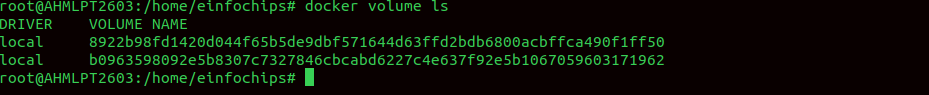

---

## Docker Attach
Attach your terminal to a running container.
```bash
docker attach <container_id>
```

---

## Docker Port Mapping
Maps a port on the host to a port in the container:
```
host_port:container_port
```
Example:
```bash
docker run -d -p 8080:80 nginx
```

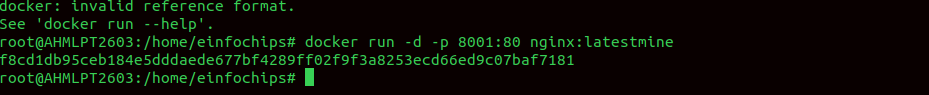
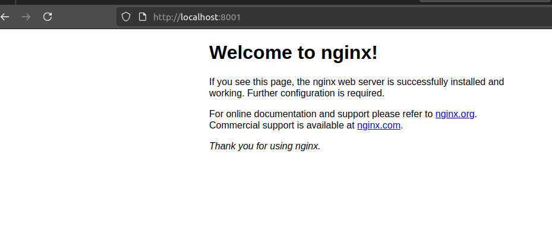

---

## Volume Mapping
```bash
docker run -v /host/path:/container/path nginx
```
This mounts a host directory inside the container.

---

## Docker Engine

Docker Engine is the core component of Docker — the actual runtime that builds, runs, distributes, and manages containers.

The Docker architecture consists of:

| Component | Description |
|------------|-------------|
| **Docker Daemon (`dockerd`)** | Background service that builds and runs containers. Listens for Docker API requests and manages images, containers, networks, and volumes. |
| **Docker REST API** | Interface between the CLI and the daemon. All Docker operations are API-based. |
| **Docker CLI (`docker`)** | Command-line client that interacts with Docker Daemon through the API. |

### Architecture Diagram

```
+------------------------------------+
|           User / DevOps            |
|------------------------------------|
|  Docker CLI  (docker command)      |
+--------------------|---------------+
                     |
                     v
+------------------------------------+
|         Docker REST API            |
+--------------------|---------------+
                     |
                     v
+------------------------------------+
|     Docker Daemon (dockerd)        |
|   - Manages containers & images    |
|   - Handles builds, networks, etc. |
+--------------------|---------------+
                     |
                     v
+------------------------------------+
|     Container Runtime (runc)       |
+------------------------------------+
```

### How It Works
1. Docker CLI sends the command to the Docker daemon.  
2. Docker Daemon interprets it via the Docker API.  
3. Daemon checks if the image (e.g., `nginx:latest`) exists locally.  
   - If not, it pulls it from Docker Hub.  
4. Daemon creates a container layer, sets up networking and volumes.  
5. Container starts using `containerd` and `runc`.  
6. The container runs and is accessible on the mapped port.

---

## Control Groups (cgroups)

Control Groups (cgroups) limit and monitor container resource usage (CPU, memory, disk I/O, etc.).

Examples:
```bash
docker run -d --name testmem --memory=200m nginx
docker run -d --name testcpu --cpus="0.5" nginx
```

---

## Docker Links (Legacy Feature)

Before user-defined networks existed, Docker used links to connect containers.

Example:
```bash
docker run -d --name db mysql
docker run -d --name web --link db nginx
```

---

## How to Reduce Image Size

1. Use smaller base images (e.g., `alpine` instead of `ubuntu`).  
2. Combine commands to reduce layers:
   ```dockerfile
   RUN apt-get update && apt-get install -y curl
   ```
3. Clean up caches:
   ```dockerfile
   RUN apt-get clean && rm -rf /var/lib/apt/lists/*
   ```
4. Use `.dockerignore` to exclude unnecessary files.  
5. Avoid installing unnecessary packages.  
6. Use multi-stage builds to copy only final artifacts.

---

## Layered Architecture

Docker images are made up of **layers**. Each instruction in a Dockerfile (`FROM`, `RUN`, `COPY`, etc.) creates a new layer.

- Layers are **cached** for efficiency.
- Reusing layers speeds up builds.
- Changes to one layer only rebuild dependent layers.

---

## Environment Variables

Set environment variables in a container:
```bash
docker run -e MYVAR=value nginx
```

Or in a Dockerfile:
```dockerfile
ENV MYVAR=value
```

To view them:
```bash
docker inspect <container_name>
```

---

## Docker Storage

Docker uses a **storage driver** to manage image and container layers. Common drivers include:
- `overlay2` (default)
- `aufs`
- `btrfs`
- `zfs`

Each container’s writable layer is isolated but built upon shared read-only image layers.

---

## Docker Networking

Types of Docker networks:
- **bridge** (default): connects containers on the same host.
- **host**: shares host networking stack.
- **none**: disables networking.
- **overlay**: multi-host networking for Swarm or Kubernetes.

Example:
```bash
docker network create mynet
docker run -d --network=mynet --name=web nginx
```

---

## Docker Compose

Docker Compose simplifies multi-container setups with a `docker-compose.yml` file.

Example:
```yaml
version: '3.9'

services:
  backend:
    build: ./backend
    container_name: flask_backend
    ports:
      - "5000:5000"
    depends_on:
      - db
    networks:
      - app-network

  nginx:
    image: nginx:latest
    container_name: nginx_frontend
    ports:
      - "8080:80"
    volumes:
      - ./nginx/default.conf:/etc/nginx/conf.d/default.conf
    depends_on:
      - backend
    networks:
      - app-network

  db:
    image: mysql:5.7
    container_name: mysql_db
    restart: always
    environment:
      MYSQL_ROOT_PASSWORD: rootpassword
      MYSQL_DATABASE: testdb
    ports:
      - "3306:3306"
    networks:
      - app-network

networks:
  app-network:
    driver: bridge

```

Run it:
```bash
docker-compose up -d
```

---

## Namespaces and PID Isolation

Namespaces provide process isolation.  
PID namespace isolates process IDs inside containers.

Example:
```bash
docker run -it ubuntu bash
ps -ef
```
Inside container, process IDs start from 1 (container's own PID space).

---

## Summary

- Docker Engine manages images, containers, networks, and volumes.
- Namespaces and cgroups isolate and limit containers.
- Volumes persist data beyond container life.
- Networking enables container communication.
- Layered architecture and caching optimize builds.
- Best practices like multi-stage builds and Alpine images reduce image size.


Difference Between COPY and ADD
COPY
Used only to copy files/folders from your local system into the Docker image.

ADD
Does everything COPY does, plus a few extra features
 - Can extract local .tar archives automatically.
 - Can download files from a URL directly.(Use ADD only when you need the extra features (like      auto-extracting archives or downloading from a URL))

CMD vs Entrypoint

- Both define what command runs when your container starts, but they differ in flexibility and override

CMD:
Provides default arguments or commands for the container.
It can be overridden easily when running the container.

```bash
CMD ["executable", "param1", "param2"]
```

ENTRYPOINT:
Defines the main command that always runs.
Arguments passed to docker run are appended to it (not replaced).

