# EKS Deployment of Myapp(react,node and MYsql as RDS)
Monitoring using cloudwatc
MYAPP

frontend
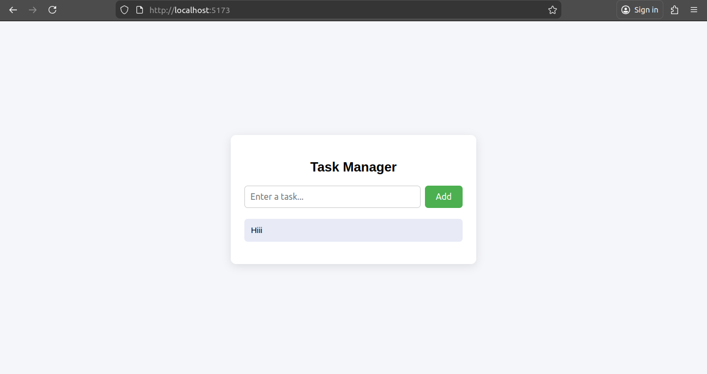

Backend

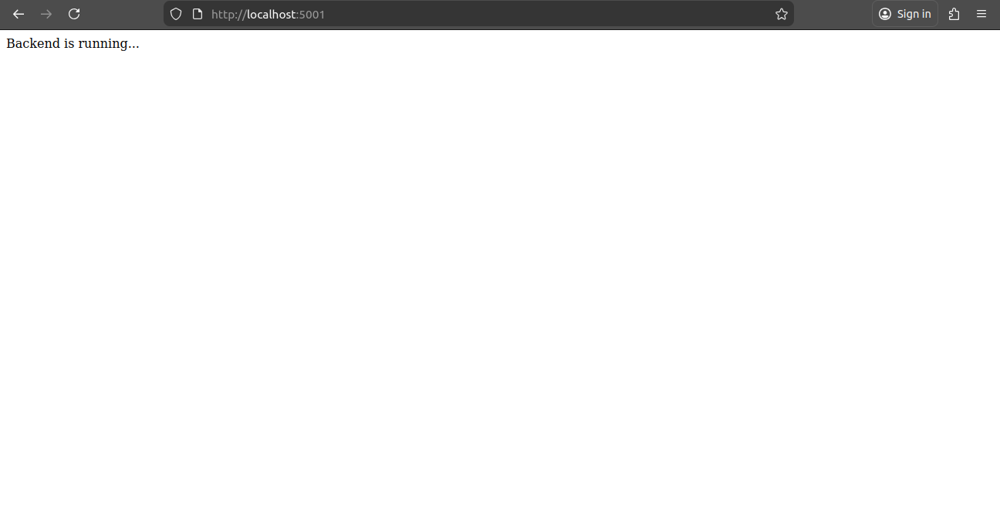

Mysql

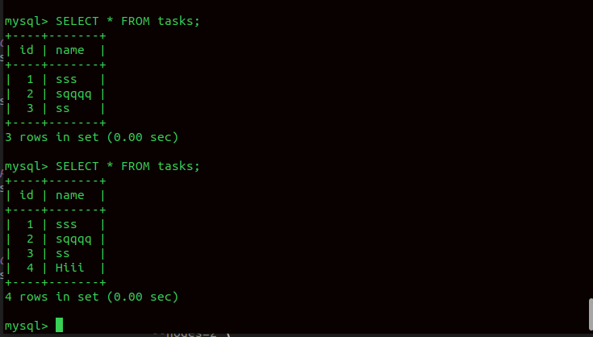

First and foremost Dockerize your application

Dockerfile for Node Js backend application

```bash
FROM node:18-alpine
WORKDIR /app
COPY package*.json ./
RUN npm install
COPY . .
EXPOSE 5000
CMD ["node", "server.cjs"] 

```

Dockerfile for frontend Application

```bash

# Build Stage
FROM node:18 as build

WORKDIR /app
COPY package*.json ./
RUN npm install
COPY . .
RUN npm run build

# Serve using nginx
FROM nginx:alpine
COPY --from=build /app/dist /usr/share/nginx/html

EXPOSE 80
CMD ["nginx", "-g", "daemon off;"]

```
```bash
docker build -t myapp-frontend:latest .
```

then push these ./images/images to docker registry

```bash
tag the ./images/image

docker tag myapp-frontend(./images/imagename) 1jashah/mytaskappfrontend:latest
docker tag SOURCE_./images/image[:TAG] TARGET_REGISTRY/NAMESPACE/REPOSITORY[:TAG]

docker push 1jashshah/mytaskappfrontend:latest
```
Do same for backend app

### create an EKS cluster with nodegroups using below script

```bash
#!/bin/bash

eksctl create cluster --name=eksclusterofmyapp \
                      --region=ap-south-1 \
                      --zones=ap-south-1a,ap-south-1b \
                      --without-nodegroup 

# Get List of clusters
eksctl get cluster           


eksctl utils associate-iam-oidc-provider \
    --region region-code \
    --cluster eksclusterofmyapp \
    --approve

# Replace with region & cluster name
eksctl utils associate-iam-oidc-provider \
    --region ap-south-1 \
    --cluster eksclusterofmyapp \
    --approve       

# Create Public Node Group   
eksctl create nodegroup --cluster=eksclusterofmyapp \
                       --region=ap-south-1 \
                       --name=eksclusterofmyapp-ng-public1 \
                       --node-type=t3.medium \
                       --nodes=2 \
                       --nodes-min=2 \
                       --nodes-max=4 \
                       --node-volume-size=20 \
                       --ssh-access \
                       --ssh-public-key=linux \
                       --managed \
                       --asg-access \
                       --external-dns-access \
                       --full-ecr-access \
                       --appmesh-access \
                       --alb-ingress-access 

eksctl get cluster

eksctl get nodegroup --cluster=eksclusterofmyapp

kubectl get nodes 

```
After creation of cluster
Our Networking Should look like this

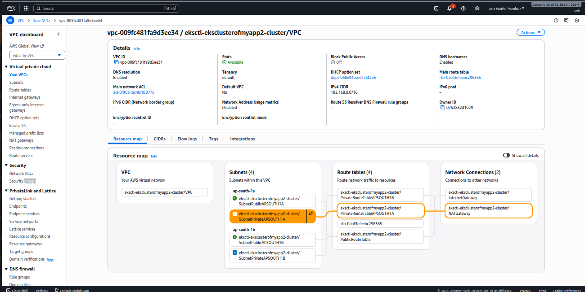


create a namespace 
a Namespace functions as a virtual cluster within a physical Kubernetes cluster, providing a mechanism to logically isolate resources and environments. Namespaces are a fundamental concept for organizing and managing resources,

```bash
apiVersion: v1
kind: Namespace
metadata:
  name: myapp
```

After that create an RDS Mysql

for RDS create a Security Group

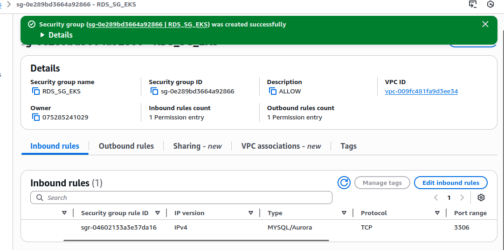
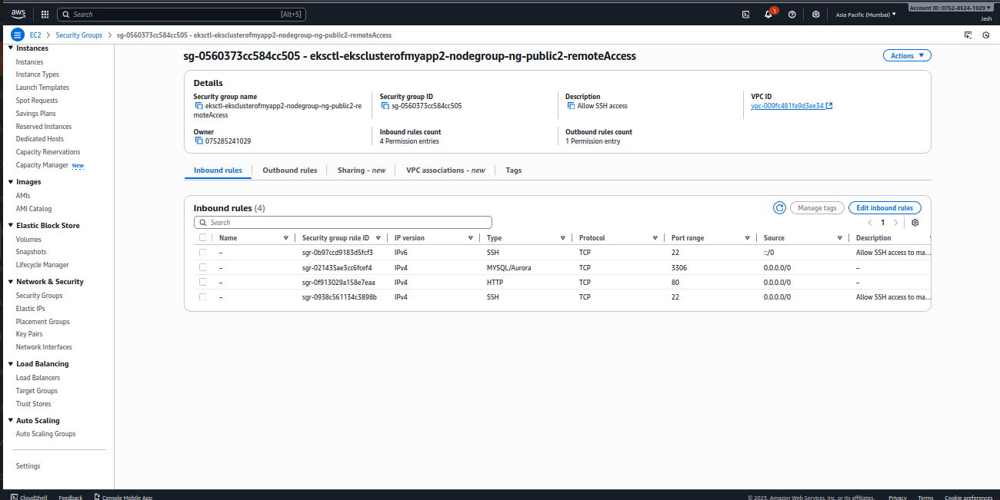

after creation of Security Group and create subnet group use (EKS VPC and Private subnets)

create RDS subnet group

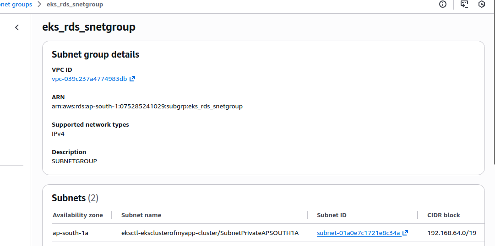

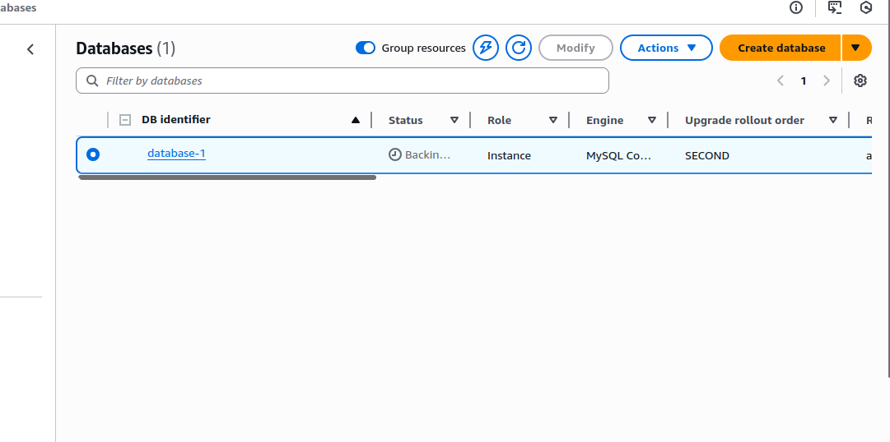 while creating
and then change to 
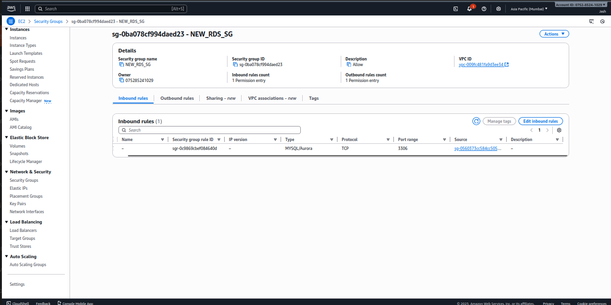

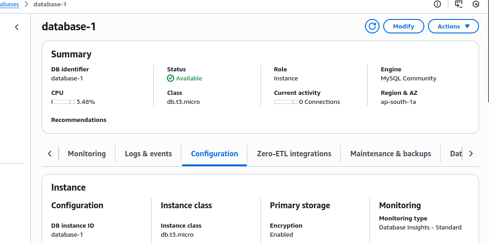


after that create a secrets.yml

```bash
apiVersion: v1
kind: Secret
metadata:
  name: app-secret
  namespace: myapp
type: Opaque
stringData:
  DB_HOST: database-1.cvkeqy8c2n2t.ap-south-1.rds.amazonaws.com(RDS endpoint)
  DB_PORT: "3306"
  DB_USER: taskuser
  DB_PASS: password123
  DB_NAME: taskdb
```

in your backend app 
should have this 

Create deployments for backend and frontend as well as

```bash -- Frontend Deployment
apiVersion: apps/v1
kind: Deployment
metadata:
  name: frontend
  namespace: myapp
spec:
  replicas: 2
  selector:
    matchLabels:
      app: frontend
  template:
    metadata:
      labels:
        app: frontend
    spec:
      containers:
        - name: frontend
          ./images/image: 1jashshah/newest./images/image:latest
          ports:
            - containerPort: 80
          resources:
            requests:
              cpu: "50m"
              memory: "128Mi"
            limits:
              cpu: "100m"
              memory: "256Mi"
          env:
            - name: VITE_API_URL
              value: "/api"
---
apiVersion: v1
kind: Service
metadata:
  name: frontend
  namespace: myapp
spec:
  selector:
    app: frontend
  ports:
    - port: 80
      targetPort: 80
  type: NodePort
```
```bash Backend-Deployment
apiVersion: apps/v1
kind: Deployment
metadata:
  name: backend
  namespace: myapp
spec:
  replicas: 1
  selector:
    matchLabels:
      app: backend
  template:
    metadata:
      labels:
        app: backend
    spec:
      containers:
        - name: backend
          ./images/image: 1jashshah/anotherbackend:latest
          ports:
            - containerPort: 5000
          env:
            - name: DB_HOST
              valueFrom:
                secretKeyRef:
                  name: app-secret
                  key: DB_HOST

            - name: DB_PORT
              valueFrom:
                secretKeyRef:
                  name: app-secret
                  key: DB_PORT

            - name: DB_USER
              valueFrom:
                secretKeyRef:
                  name: app-secret
                  key: DB_USER

            - name: DB_PASS
              valueFrom:
                secretKeyRef:
                  name: app-secret
                  key: DB_PASS

            - name: DB_NAME
              valueFrom:
                secretKeyRef:
                  name: app-secret
                  key: DB_NAME
---
apiVersion: v1
kind: Service
metadata:
  name: backend
  namespace: myapp
spec:
  selector:
    app: backend
  type: NodePort
  ports:
    - port: 5000        # Service port (inside cluster)
      targetPort: 5000  # Container port
      nodePort: 30050   # (optional) Port exposed on every worker node
```


Connect to RDS Database using kubectl and create tasks schema/db

```bash

kubectl run -it --rm --./images/image=mysql:latest --restart=Never mysql-client -- mysql -h taskdb.cvkeqy8c2n2t.ap-south-1.rds.amazonaws.com -u taskuser -p password123
```
```bash

mysql> show schemas;
mysql> create database taskdb;
mysql> 
CREATE TABLE IF NOT EXISTS tasks (
        id INT AUTO_INCREMENT PRIMARY KEY,
        task VARCHAR(255)
    )
mysql> exit
```

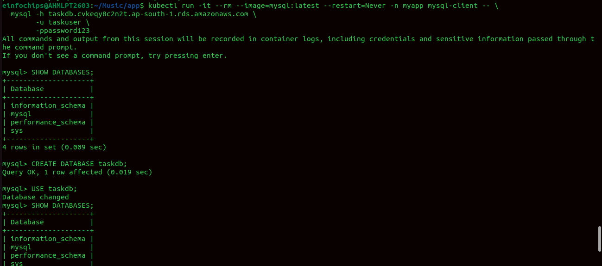

Enable IAM OIDC Provider

```bash
eksctl utils associate-iam-oidc-provider \
  --region ap-south-1 \
  --cluster <YOUR_CLUSTER_NAME> \
  --approve
```
Download IAM Policy for ALB Controller

```bash
curl -o iam-policy.json \
https://raw.githubusercontent.com/kubernetes-sigs/aws-load-balancer-controller/main/docs/install/iam_policy.json
```
Create IAM policy
```bash
aws iam create-policy \
  --policy-name AWSLoadBalancerControllerIAMPolicy \
  --policy-document file://iam-policy.json
```
Create IAM Service Account
If you're setting up AWS Load Balancer Controller →

 You should use IRSA
 NOT Pod Identity

```bash  -- IRSA(IAM Role for Service Accounts)

eksctl create iamserviceaccount \
  --cluster <CLUSTER_NAME> \
  --namespace kube-system \
  --name aws-load-balancer-controller \
  --attach-policy-arn arn:aws:iam::<ACCOUNT_ID>:policy/AWSLoadBalancerControllerIAMPolicy \
  --approve

```

Install ALB COntroller
```bash
helm repo add eks https://aws.github.io/eks-charts
helm repo update

helm install aws-load-balancer-controller eks/aws-load-balancer-controller \
  -n kube-system \
  --set clusterName=<CLUSTER_NAME> \
  --set serviceAccount.create=false \
  --set serviceAccount.name=aws-load-balancer-controller
```
Create Ingress.yml
```bash
apiVersion: networking.k8s.io/v1
kind: Ingress
metadata:
  name: myapp-ingress2
  namespace: myapp
  annotations:
    kubernetes.io/ingress.class: alb
    alb.ingress.kubernetes.io/scheme: internet-facing
    alb.ingress.kubernetes.io/backend-protocol: HTTP
    alb.ingress.kubernetes.io/listen-ports: '[{"HTTP":80}]'
    alb.ingress.kubernetes.io/target-type: ip

spec:
  rules:
    - http:
        paths:
          - path: /
            pathType: Prefix
            backend:
              service:
                name: frontend
                port:
                  number: 80

          - path: /api
            pathType: Prefix
            backend:
              service:
                name: backend
                port:
                  number: 5000
```
```bash
kubectl get ingress -n myapp
```
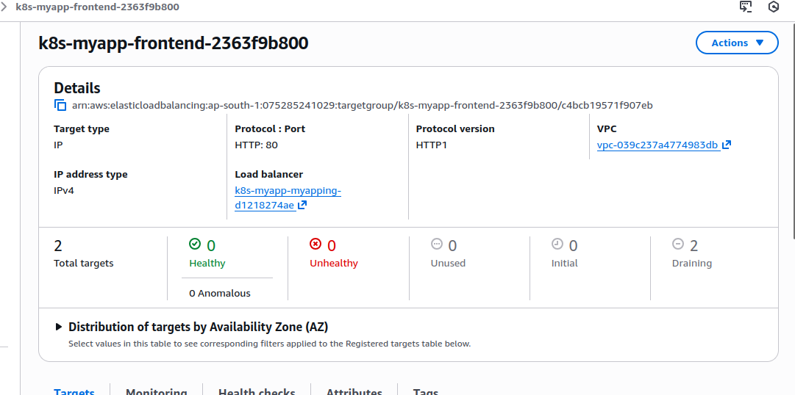

Pod-Autoscaling
HPA-ForntendPod
```bash
apiVersion: autoscaling/v2
kind: HorizontalPodAutoscaler
metadata:
  name: frontend-hpa
  namespace: myapp
spec:
  scaleTargetRef:
    apiVersion: apps/v1
    kind: Deployment
    name: frontend
  minReplicas: 2
  maxReplicas: 10
  metrics:
  - type: Resource
    resource:
      name: cpu
      target:
        type: Utilization
        averageUtilization: 50
```


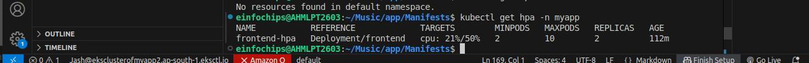

generate a load

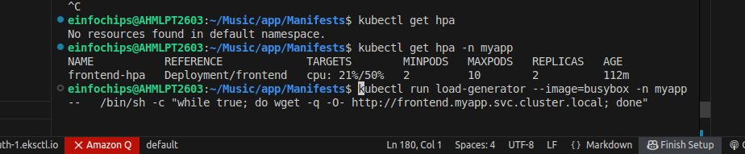

Associate CloudWatch Policy to our EKS Worker Nodes Role

Go to Services -> EC2 -> Worker Node EC2 Instance -> IAM Role -> Click on that role

```bash
# Sample Role ARN
arn:aws:iam::180789647333:role/eksctl-eksdemo1-nodegroup-eksdemo-NodeInstanceRole-1FVWZ2H3TMQ2M

# Policy to be associated
Associate Policy: CloudWatchAgentServerPolicy
```
Install Container Insights
Deploy CloudWatch Agent and Fluentd as DaemonSets

    This command will
        Creates the Namespace amazon-cloudwatch.
        Creates all the necessary security objects for both DaemonSet:
            SecurityAccount
            ClusterRole
            ClusterRoleBinding
        Deploys Cloudwatch-Agent (responsible for sending the metrics to CloudWatch) as a DaemonSet.
        Deploys fluentd (responsible for sending the logs to Cloudwatch) as a DaemonSet.
        Deploys ConfigMap configurations for both DaemonSets.
```bash
# Template
curl -s https://raw.githubusercontent.com/aws-samples/amazon-cloudwatch-container-insights/latest/k8s-deployment-manifest-templates/deployment-mode/daemonset/container-insights-monitoring/quickstart/cwagent-fluentd-quickstart.yaml | sed "s/{{cluster_name}}/<REPLACE_CLUSTER_NAME>/;s/{{region_name}}/<REPLACE-AWS_REGION>/" | kubectl apply -f -

# Replaced Cluster Name and Region
curl -s https://raw.githubusercontent.com/aws-samples/amazon-cloudwatch-container-insights/latest/k8s-deployment-manifest-templates/deployment-mode/daemonset/container-insights-monitoring/quickstart/cwagent-fluentd-quickstart.yaml | sed "s/{{cluster_name}}/eksdemo1/;s/{{region_name}}/us-east-1/" | kubectl apply -f -
```
List Daemonsets
```bash
kubectl -n amazon-cloudwatch get daemonsets
```

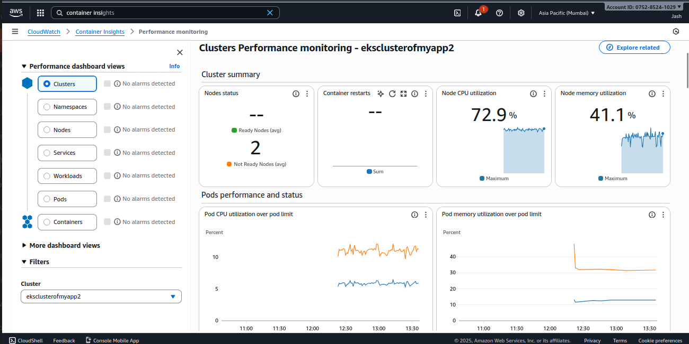

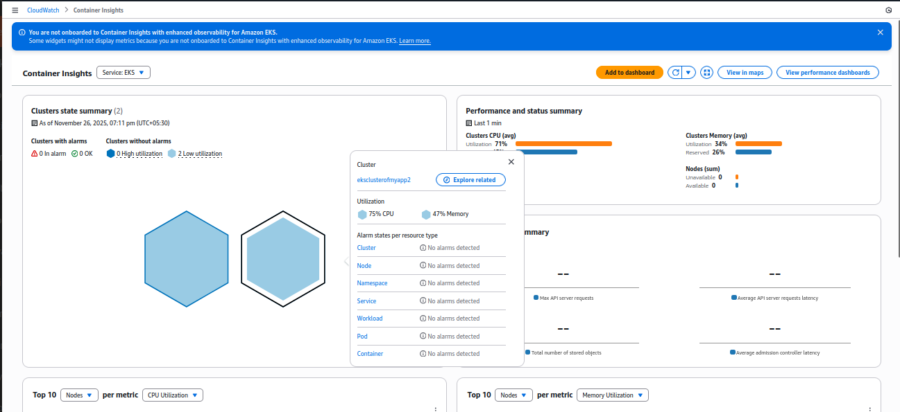

Cluster autoscaller:
The Kubernetes Cluster Autoscaler automatically adjusts the number of nodes in your cluster when pods fail to launch due to lack of resources or when nodes in the cluster are underutilized and their pods can be rescheduled onto other nodes in the cluster.

Verify if our NodeGroup as --asg-access

    We need to ensure that we have a parameter named --asg-access present during the cluster or nodegroup creation.
    Verify the same when we created our cluster node group

What will happen if we use --asg-access tag?
 
    It enables IAM policy for cluster-autoscaler
    Lets review our nodegroup IAM role for the same.
    Go to Services -> IAM -> Roles -> eksctl-eksdemo1-nodegroup-XXXXXX
    Click on Permissions tab
    You should see a inline policy named eksctl-eksdemo1-nodegroup-eksdemo1-ng-private1-PolicyAutoScaling in the list of policies associated to this role.

Deploy Cluster Autoscaler

```bash
# Deploy the Cluster Autoscaler to your cluster
kubectl apply -f https://raw.githubusercontent.com/kubernetes/autoscaler/master/cluster-autoscaler/cloudprovider/aws/examples/cluster-autoscaler-autodiscover.yaml

# Add the cluster-autoscaler.kubernetes.io/safe-to-evict annotation to the deployment
kubectl -n kube-system annotate deployment.apps/cluster-autoscaler cluster-autoscaler.kubernetes.io/safe-to-evict="false"
```

Edit Cluster Autoscaler Deployment to add Cluster name and two more parameters

```bash
kubectl -n kube-system edit deployment.apps/cluster-autoscaler
```
```bash
# Before Change
        - --node-group-auto-discovery=asg:tag=k8s.io/cluster-autoscaler/enabled,k8s.io/cluster-autoscaler/<YOUR CLUSTER NAME>

# After Change
        - --node-group-auto-discovery=asg:tag=k8s.io/cluster-autoscaler/enabled,k8s.io/cluster-autoscaler/eksdemo1
```

    Add two more parameters
```bash
        - --balance-similar-node-groups
        - --skip-nodes-with-system-pods=false
```

Sample for reference

    spec:
      containers:
      - command:
        - ./cluster-autoscaler
        - --v=4
        - --stderrthreshold=info
        - --cloud-provider=aws
        - --skip-nodes-with-local-storage=false
        - --expander=least-waste
        - --node-group-auto-discovery=asg:tag=k8s.io/cluster-autoscaler/enabled,k8s.io/cluster-autoscaler/eksdemo1
        - --balance-similar-node-groups
        - --skip-nodes-with-system-pods=false

: Set the Cluster Autoscaler ./images/image related to our current EKS Cluster version
# Template
# Update Cluster Autoscaler ./images/image Version
kubectl -n kube-system set ./images/image deployment.apps/cluster-autoscaler cluster-autoscaler=us.gcr.io/k8s-artifacts-prod/autoscaling/cluster-autoscaler:v1.XY.Z


# Update Cluster Autoscaler ./images/image Version
kubectl -n kube-system set ./images/image deployment.apps/cluster-autoscaler cluster-autoscaler=us.gcr.io/k8s-artifacts-prod/autoscaling/cluster-autoscaler:v1.16.5

Verify ./images/image version got updated
```bash
kubectl -n kube-system get deployment.apps/cluster-autoscaler -o yaml
```
sample partial output

```bash
    spec:
      containers:
      - command:
        - ./cluster-autoscaler
        - --v=4
        - --stderrthreshold=info
        - --cloud-provider=aws
        - --skip-nodes-with-local-storage=false
        - --expander=least-waste
        - --node-group-auto-discovery=asg:tag=k8s.io/cluster-autoscaler/enabled,k8s.io/cluster-autoscaler/eksdemo1
        - --balance-similar-node-groups
        - --skip-nodes-with-system-pods=false
        ./images/image: us.gcr.io/k8s-artifacts-prod/autoscaling/cluster-autoscaler:v1.16.5
```

View Cluster Autoscaler logs to verify that it is monitoring your cluster load.

```bash
kubectl -n kube-system logs -f deployment.apps/cluster-autoscaler
```

Clean-Up

```bash
eksctl delete cluster clusterformyapp2
```
Created by: Jash Shah