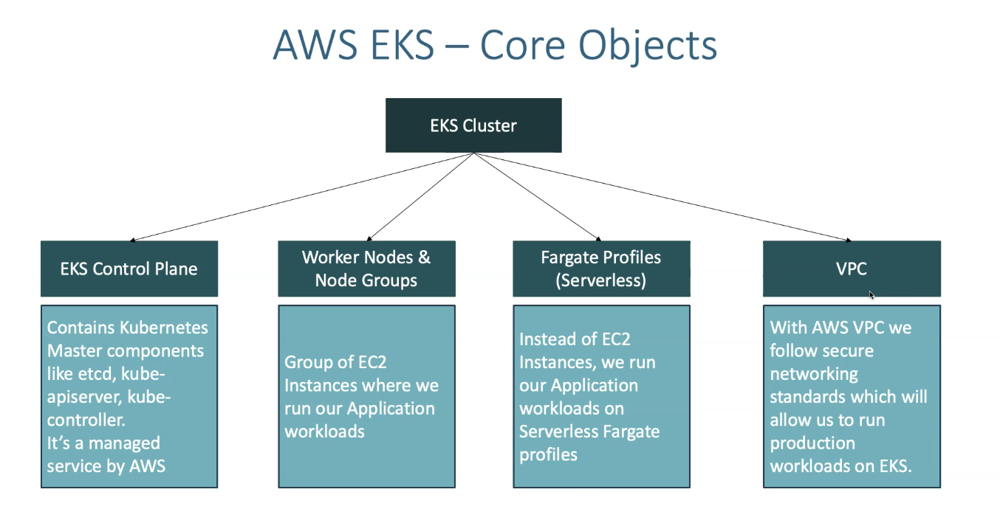
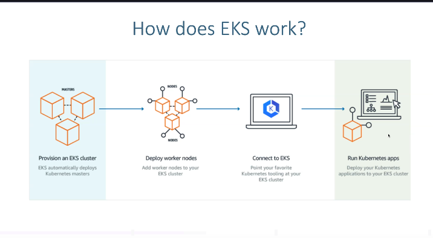
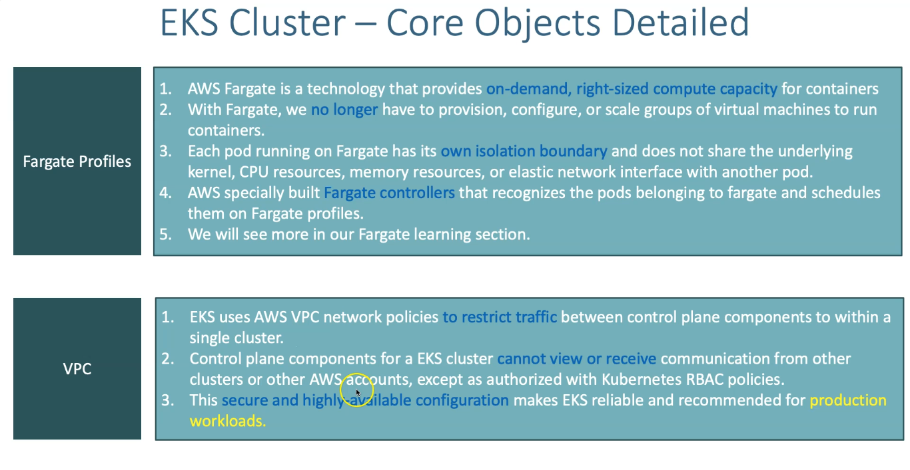
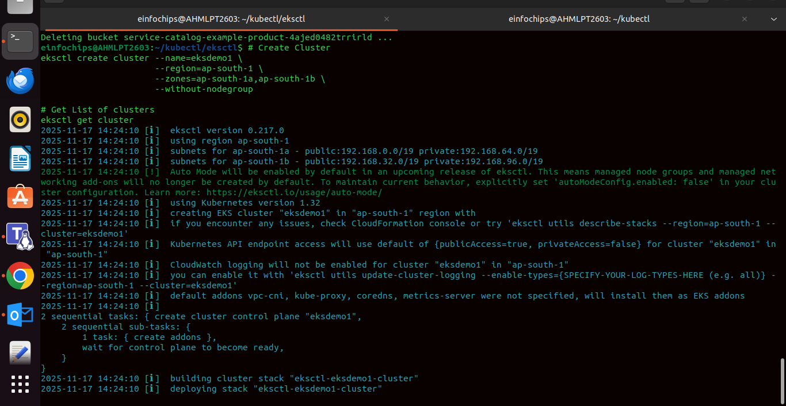
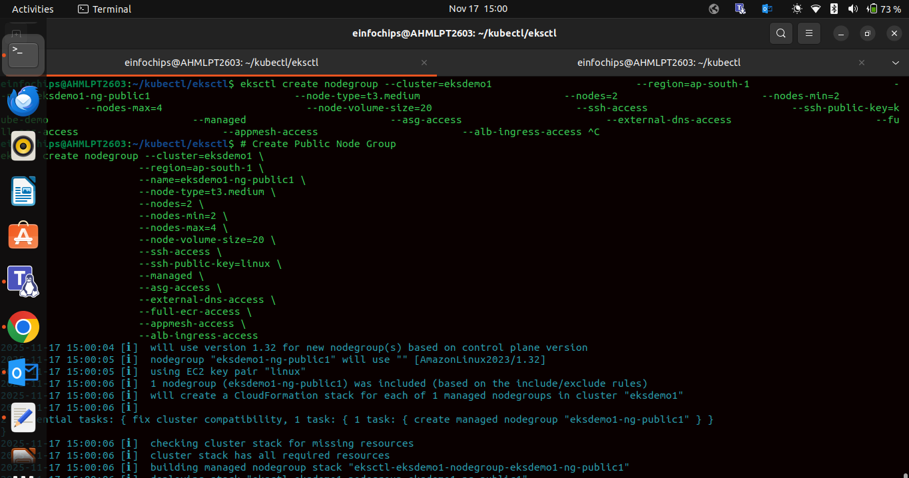
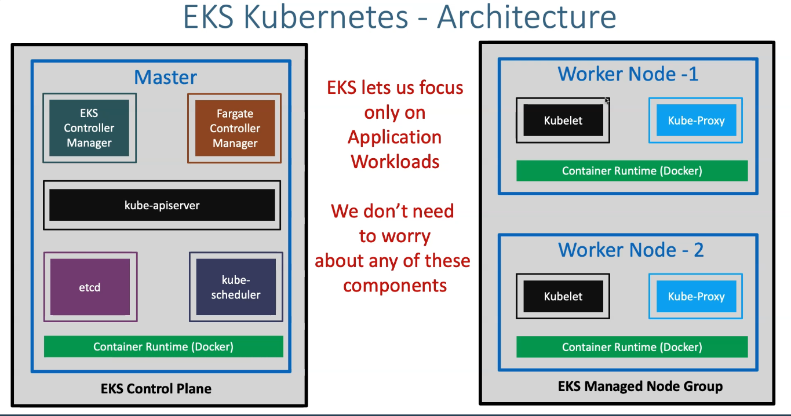

# EKS & Kubernetes Overview

## Most Important CLI Tools

### AWS CLI

Used to interact with AWS services from the command line.

### kubectl

CLI tool to interact with Kubernetes clusters.

### eksctl

Simple CLI tool for creating and managing EKS clusters.

------------------------------------------------------------------------

## EKS Core Objects

------------------------------------------------------------------------

## How Does EKS Work?

 

------------------------------------------------------------------------

## EKS Fargate Profile and VPC

------------------------------------------------------------------------

## Creating an EKS Cluster using eksctl

------------------------------------------------------------------------

## Creating a Nodegroup

 

------------------------------------------------------------------------

## Architecture of Kubernetes

Kubernetes consists of:

-   Control Plane\
-   API Server\
-   Scheduler\
-   Controller Manager\
-   etcd\
-   Worker Nodes\
-   Kubelet\
-   Kube Proxy

------------------------------------------------------------------------

## Kubernetes vs EKS

------------------------------------------------------------------------

## Kubernetes Pods & Ports

-   A pod can run **multiple containers**, but they **share the same
    network namespace**.
-   This means: ✔ Only **one IP address**\
    ✔ Containers can expose **multiple ports**, but best practice is
    **one main container per pod**.

------------------------------------------------------------------------

## Kubernetes Services

We can expose an application running on a set of PODs using different
service types.

### NodePort

Used to access an application **outside the cluster**.\
Exposes the service on each worker node's IP at a static port.

------------------------------------------------------------------------

## ReplicaSets

A ReplicaSet ensures that a specified number of pod replicas are always
running.

------------------------------------------------------------------------

## EKS Pod Identity Agent

The Pod Identity Agent runs on each node and provides **temporary IAM
credentials** to pods securely.

It replaces older methods like: - kube2iam\
- kiam\
- complex OIDC configurations

It simplifies pod → AWS access.

------------------------------------------------------------------------
POD Identity Agent

Pod Identity Agent is a component in Amazon EKS that runs on every worker node and provides temporary IAM credentials to Kubernetes pods securely.

It enables pods to access AWS services (S3, DynamoDB, SQS, RDS, etc.) without storing long-term credentials, and without needing old tools like:

Use cases :

imagine a microservice running inside EKS that needs to:

Download images from an S3 bucket

Write logs to CloudWatch Logs

Read parameters from SSM Parameter Store

Assign S3 Read Permissions to a Pod Using Pod Identity

