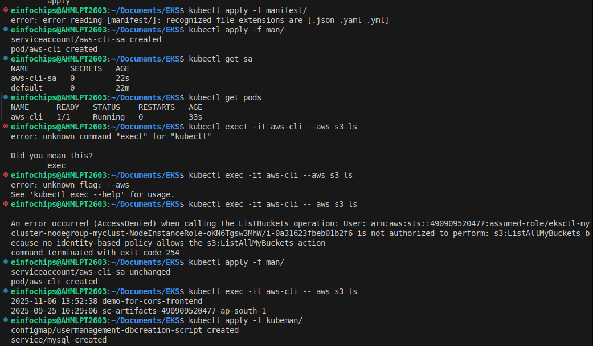
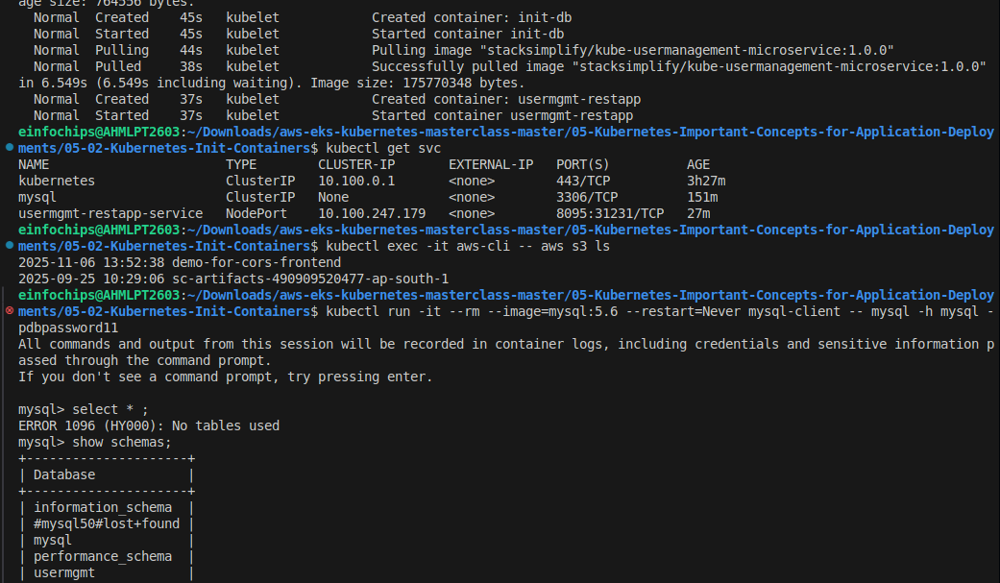
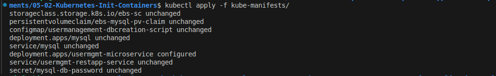
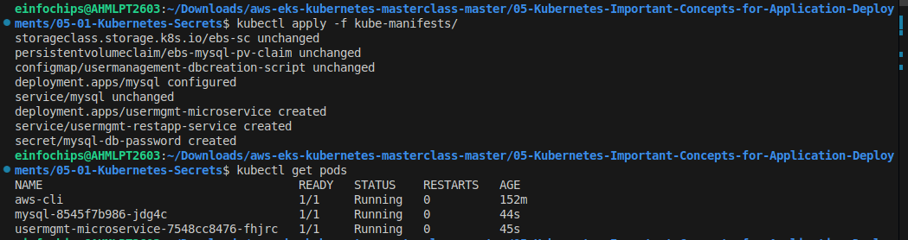
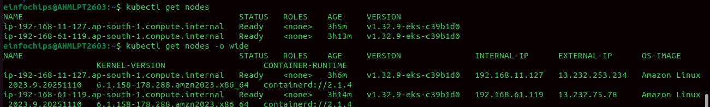
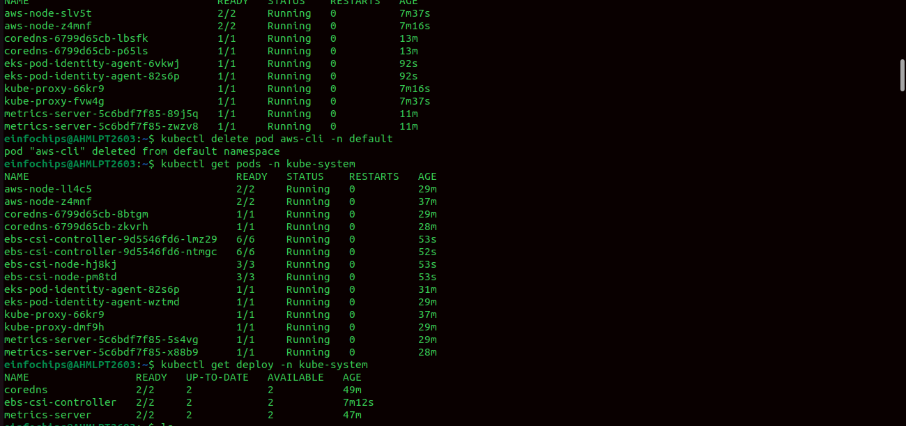
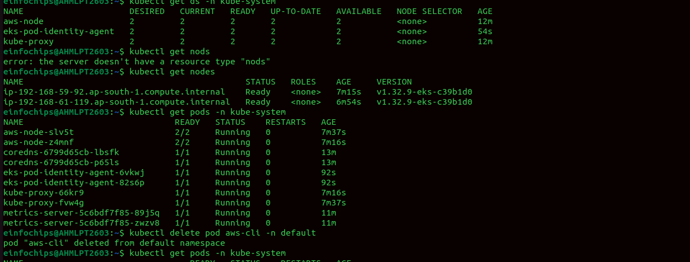

# Amazon EKS Pod Identity Agent - Demo

## Amazon EKS Pod Identity – High-Level Flow
Amazon EKS Pod Identity enables pods in your cluster to securely assume IAM roles without managing static credentials or using IRSA annotations. The high-level flow is shown below:
1. **Create IAM Role**  
   An IAM administrator creates a role that can be assumed by the new EKS service principal:  
   `pods.eks.amazonaws.com`.  
   - Trust policy can be restricted by cluster ARN or AWS account.  
   - Attach required IAM policies (e.g., AmazonS3ReadOnlyAccess).  

2. **Create Pod Identity Association**  
   The EKS administrator associates the IAM Role with a Kubernetes Service Account + Namespace.  
   - Done via the EKS Console or `CreatePodIdentityAssociation` API.  

3. **Webhook Mutation**  
   When a pod using that Service Account is created, the **EKS Pod Identity Webhook** (running in the control plane) mutates the pod spec:  
   - Injects environment variables such as `AWS_CONTAINER_CREDENTIALS_FULL_URI`.  
   - Mounts a projected service account token for use by the Pod Identity Agent.  


4. **Pod Requests Credentials**
   Inside the pod, the AWS SDK/CLI uses the default credential provider chain.

   * It discovers the injected environment variables and calls the **EKS Pod Identity Agent** running as a DaemonSet on the worker node.

   **4a. PIA Agent Calls EKS Auth API**

   * The Pod Identity Agent exchanges the projected token with the **EKS Auth API** using `AssumeRoleForPodIdentity`.

   **4b. EKS Auth API Validates Association**

   * The API checks the Pod Identity Association (Namespace + ServiceAccount → IAM Role).
   * If valid, it returns temporary IAM credentials back to the Pod Identity Agent.

5. **Pod Accesses AWS Resources**
   The AWS SDK/CLI inside the pod now has valid, short-lived credentials and can call AWS services (e.g., list S3 buckets).
   

---

### Key Notes
* Pods receive **temporary IAM credentials** automatically — no `aws configure` needed.
* Leverages the **standard AWS SDK credential chain** (no code changes required).
* Requires the **EKS Pod Identity Agent Add-on** running on worker nodes.
* Supported only with newer versions of AWS SDKs and CLI.


## Step-00: What we’ll do
In this demo, we’ll understand and implement the **Amazon EKS Pod Identity Agent (PIA)**.

1. Install the **EKS Pod Identity Agent** add-on  
2. Create a **Kubernetes AWS CLI Pod** in the EKS Cluster and attempt to list S3 buckets (this will fail initially)  
3. Create an **IAM Role** with trust policy for Pod Identity → allow Pods to access **Amazon S3**  
4. Create a **Pod Identity Association** between the Kubernetes Service Account and IAM Role  
5. Re-test from the AWS CLI Pod, successfully list S3 buckets  
6. Through this flow, we will clearly understand how **Pod Identity Agent** works in EKS  

---

## Step-01: Install EKS Pod Identity Agent
1. Open **EKS Console** → **Clusters** → select your cluster (`eksdemo1`)  
2. Go to **Add-ons** → **Get more add-ons**  
3. Search for **EKS Pod Identity Agent**  
4. Click **Next** → **Create**  

This installs a **DaemonSet** (`eks-pod-identity-agent`) that enables Pod Identity associations.

```yaml
# List k8s PIA Resources
kubectl get daemonset -n kube-system

# List k8s Pods
kubectl get pods -n kube-system
```

---

## Step-02: Deploy AWS CLI Pod (without Pod Identity Association)
### Step-02-01: Create Service Account 
```yaml
apiVersion: v1
kind: ServiceAccount
metadata:
  name: aws-cli-sa
  namespace: default
```

### Step-02-02: Create a simple Kubernetes Pod with AWS CLI image:
```yaml
apiVersion: v1
kind: Pod
metadata:
  name: aws-cli
  namespace: default
spec:
  serviceAccountName: aws-cli-sa
  containers:
  - name: aws-cli
    image: amazon/aws-cli
    command: ["sleep", "infinity"]
```

### Step-02-03: Deploy CLI Pod
```bash
kubectl apply -f kube-manifests/
kubectl get pods
```

### Step-02-04: Exec into the pod and try to list S3 buckets:
```bash
kubectl exec -it aws-cli -- aws s3 ls
```

**Observation:**  This should **fail** because no IAM permissions are associated with the Pod.  

#### Error Message
```
kalyan-mini2:04-00-EKS-Pod-Identity-Agent kalyan$ kubectl exec -it aws-cli -- aws s3 ls

An error occurred (AccessDenied) when calling the ListBuckets operation: User: arn:aws:sts::180789647333:assumed-role/eksctl-eksdemo1-nodegroup-eksdemo1-NodeInstanceRole-kxEPBrWVcOzO/i-0d65729d6d09d2540 is not authorized to perform: s3:ListAllMyBuckets because no identity-based policy allows the s3:ListAllMyBuckets action
command terminated with exit code 254
```

**Important Note:**  Notice how the error references the **EC2 NodeInstanceRole** — this proves the Pod had no direct IAM mapping.

---

## Step-03: Create IAM Role for Pod Identity
1. Go to **IAM Console** → **Roles** → **Create Role**  
2. Select **Trusted entity type** → **Custom trust policy**  
3. Add trust policy for Pod Identity, for example:  

```json
{
    "Version": "2012-10-17",
    "Statement": [
        {
            "Effect": "Allow",
            "Principal": {
                "Service": "pods.eks.amazonaws.com"
            },
            "Action": [
                "sts:AssumeRole",
                "sts:TagSession"
            ]
        }
    ]
}
```

4. Attach **AmazonS3ReadOnlyAccess** policy  
5. Create role → example name: `EKS-PodIdentity-S3-ReadOnly-Role-101`  

---

## Step-04: Create Pod Identity Association
* Go to **EKS Console** → Cluster → **Access** → **Pod Identity Associations**  
* Create new association:  

  * Namespace: `default`  
  * Service Account: `aws-cli-sa`  
  * IAM Role: `EKS-PodIdentity-S3-ReadOnly-Role-101`  
  * Click on **create**  

---

## Step-05: Test Again

> Pods don’t automatically refresh credentials after a new Pod Identity Association; they must be restarted.

1. Restart Pod
```bash
# Delete Pod
kubectl delete pod aws-cli -n default

# Create Pod
kubectl apply -f kube-manifests/02_k8s_aws_cli_pod.yaml

# List Pods
kubectl get pods
```

2. Exec into the Pod:
```bash
# List S3 buckets
kubectl exec -it aws-cli -- aws s3 ls
```

**Observation:** This time it should **succeed**, listing all S3 buckets.

---

## Step-06: Clean Up

```bash
# 1. Delete the aws-cli pod
kubectl delete -f kube-manifests/
```

- **Remove Pod Identity Association** → via **EKS Console → Access → Pod Identity Associations**  
- **Remove IAM role** → via **IAM Console → Roles** `EKS-PodIdentity-S3-ReadOnly-Role-101`

---

## Step-07: Concept Recap

* **Without Pod Identity Association:** Pod has no IAM permissions → AWS API calls fail  
* **With Pod Identity Association:** Pod Identity Agent maps Pod’s Service Account → IAM Role → AWS Permissions → API calls succeed  

---


# Amazon EBS CSI Driver on EKS (with Pod Identity)

## Step-00: What we’ll do

1. Install the **Amazon EBS CSI Driver** add-on (with IAM role via “Create recommended role”)
2. Verify installation using `kubectl`

---

## Step-01: Install Amazon EBS CSI Driver

1. Still on **Add-ons** → **Get more add-ons**
2. Search for **Amazon EBS CSI driver (`aws-ebs-csi-driver`)**
3. On the **Permissions** step, choose **Create recommended role**

   * Console will create an IAM role with the managed policy:
     **`AmazonEBSCSIDriverPolicy`**, and **`AmazonEKSClusterPolicy`**
   * Trust is automatically set to **`pods.eks.amazonaws.com`**

```json
{
    "Version": "2012-10-17",
    "Statement": [
        {
            "Effect": "Allow",
            "Principal": {
                "Service": "pods.eks.amazonaws.com"
            },
            "Action": [
                "sts:AssumeRole",
                "sts:TagSession"
            ]
        }
    ]
}
```

4. Click **Create**

> This deploys the **EBS CSI controller** Deployment and the **EBS CSI node DaemonSet**.

---

## Step-02: Verify installation

```bash
# List pods in kube-system
kubectl get pods -n kube-system
```

**Expected output (sample):**

```bash
NAME                                  READY   STATUS    RESTARTS   AGE
aws-node-np6bt                        2/2     Running   0          2h
coredns-6b9575c64c-bvlxh              1/1     Running   0          2h45m
ebs-csi-controller-6c794c785d-27mcc   6/6     Running   0          15m
ebs-csi-node-bf4nq                    3/3     Running   0          15m
eks-pod-identity-agent-mkxmw          1/1     Running   0          42m
kube-proxy-6svwq                      1/1     Running   0          2h
metrics-server-75c7985757-c2cbf       1/1     Running   0          2h45m
```

```bash
# DaemonSets
kubectl get ds -n kube-system
```

**Expected output (sample):**

```bash
NAME                     DESIRED   CURRENT   READY   UP-TO-DATE   AVAILABLE   NODE SELECTOR              AGE
aws-node                 2         2         2       2            2           <none>                     2h45m
ebs-csi-node             2         2         2       2            2           kubernetes.io/os=linux     15m
eks-pod-identity-agent   2         2         2       2            2           <none>                     42m
kube-proxy               2         2         2       2            2           <none>                     2h45m
```

```bash
# Deployments
kubectl get deploy -n kube-system
```

**Expected output (sample):**

```bash
NAME                 READY   UP-TO-DATE   AVAILABLE   AGE
coredns              2/2     2            2           2h45m
ebs-csi-controller   2/2     2            2           16m
metrics-server       2/2     2            2           2h45m
```

---

## Summary

* Installed **Amazon EBS CSI Driver** add-on (with recommended IAM role)
* Verified that the **EBS CSI controller pods** and **EBS CSI node DaemonSet** are running successfully in the cluster

---
# EKS Storage -  Storage Classes, Persistent Volume Claims

## Step-01: Introduction
- We are going to create a MySQL Database with persistence storage using AWS EBS Volumes

| Kubernetes Object  | YAML File |
| ------------- | ------------- |
| Storage Class  | 01-storage-class.yml |
| Persistent Volume Claim | 02-persistent-volume-claim.yml   |
| Config Map  | 03-UserManagement-ConfigMap.yml  |
| Deployment, Environment Variables, Volumes, VolumeMounts  | 04-mysql-deployment.yml  |
| ClusterIP Service  | 05-mysql-clusterip-service.yml  |

## Step-02: Create following Kubernetes manifests
### Create Storage Class manifest
- https://kubernetes.io/docs/concepts/storage/storage-classes/#volume-binding-mode
- **Important Note:** `WaitForFirstConsumer` mode will delay the volume binding and provisioning  of a PersistentVolume until a Pod using the PersistentVolumeClaim is created. 

### Create Persistent Volume Claims manifest
```
# Create Storage Class & PVC
kubectl apply -f kube-manifests/

# List Storage Classes
kubectl get sc

# List PVC
kubectl get pvc 

# List PV
kubectl get pv
```
### Create ConfigMap manifest
- We are going to create a `usermgmt` database schema during the mysql pod creation time which we will leverage when we deploy User Management Microservice. 

### Create MySQL Deployment manifest
- Environment Variables
- Volumes
- Volume Mounts

### Create MySQL ClusterIP Service manifest
- At any point of time we are going to have only one mysql pod in this design so `ClusterIP: None` will use the `Pod IP Address` instead of creating or allocating a separate IP for `MySQL Cluster IP service`.   

## Step-03: Create MySQL Database with all above manifests
```
# Create MySQL Database
kubectl apply -f kube-manifests/

# List Storage Classes
kubectl get sc

# List PVC
kubectl get pvc 

# List PV
kubectl get pv

# List pods
kubectl get pods 

# List pods based on  label name
kubectl get pods -l app=mysql
```

## Step-04: Connect to MySQL Database
```
# Connect to MYSQL Database
kubectl run -it --rm --image=mysql:5.6 --restart=Never mysql-client -- mysql -h mysql -pdbpassword11

[or]

# Use mysql client latest tag
kubectl run -it --rm --image=mysql:latest --restart=Never mysql-client -- mysql -h mysql -pdbpassword11

# Verify usermgmt schema got created which we provided in ConfigMap
mysql> show schemas;
```

# Deploy UserManagement Service with MySQL Database


## Step-01: Introduction
- We are going to deploy a **User Management Microservice** which will connect to MySQL Database schema **usermgmt** during startup.
- Then we can test the following APIs
  - Create Users
  - List Users
  - Delete User
  - Health Status 

| Kubernetes Object  | YAML File |
| ------------- | ------------- |
| Deployment, Environment Variables  | 06-UserManagementMicroservice-Deployment.yml  |
| NodePort Service  | 07-UserManagement-Service.yml  |

## Step-02: Create following Kubernetes manifests

### Create User Management Microservice Deployment manifest
- **Environment Variables**

| Key Name  | Value |
| ------------- | ------------- |
| DB_HOSTNAME  | mysql |
| DB_PORT  | 3306  |
| DB_NAME  | usermgmt  |
| DB_USERNAME  | root  |
| DB_PASSWORD | dbpassword11  |  

### Create User Management Microservice NodePort Service manifest
- NodePort Service

## Step-03: Create UserManagement Service Deployment & Service 
```
# Create Deployment & NodePort Service
kubectl apply -f kube-manifests/

# List Pods
kubectl get pods

# Verify logs of Usermgmt Microservice pod
kubectl logs -f <Pod-Name>

# Verify sc, pvc, pv
kubectl get sc,pvc,pv
```
- **Problem Observation:** 
  - If we deploy all manifests at a time, by the time mysql is ready our `User Management Microservice` pod will be restarting multiple times due to unavailability of Database. 
  - To avoid such situations, we can apply `initContainers` concept to our User management Microservice `Deployment manifest`.
  - We will see that in our next section but for now lets continue to test the application
- **Access Application**
```
# List Services
kubectl get svc

# Get Public IP
kubectl get nodes -o wide

# Access Health Status API for User Management Service
http://<EKS-WorkerNode-Public-IP>:31231/usermgmt/health-status
```

## Step-04: Test User Management Microservice using Postman
### Download Postman client 
- https://www.postman.com/downloads/ 
### Import Project to Postman
- Import the postman project `AWS-EKS-Masterclass-Microservices.postman_collection.json` present in folder `04-03-UserManagement-MicroService-with-MySQLDB`
### Create Environment in postman
- Go to Settings -> Click on Add
- **Environment Name:** UMS-NodePort
  - **Variable:** url
  - **Initial Value:** http://WorkerNode-Public-IP:31231
  - **Current Value:** http://WorkerNode-Public-IP:31231
  - Click on **Add**
### Test User Management Services
- Select the environment before calling any API
- **Health Status API**
  - URL: `{{url}}/usermgmt/health-status`
- **Create User Service**
  - URL: `{{url}}/usermgmt/user`
  - `url` variable will replaced from environment we selected
```json
    {
        "username": "admin1",
        "email": "dkalyanreddy@gmail.com",
        "role": "ROLE_ADMIN",
        "enabled": true,
        "firstname": "fname1",
        "lastname": "lname1",
        "password": "Pass@123"
    }
```
- **List User Service**
  - URL: `{{url}}/usermgmt/users`

- **Update User Service**
  - URL: `{{url}}/usermgmt/user`
```json
    {
        "username": "admin1",
        "email": "dkalyanreddy@gmail.com",
        "role": "ROLE_ADMIN",
        "enabled": true,
        "firstname": "fname2",
        "lastname": "lname2",
        "password": "Pass@123"
    }
```  
- **Delete User Service**
  - URL: `{{url}}/usermgmt/user/admin1`

## Step-05: Verify Users in MySQL Database
```
# Connect to MYSQL Database
kubectl run -it --rm --image=mysql:5.6 --restart=Never mysql-client -- mysql -h mysql -u root -pdbpassword11

# Verify usermgmt schema got created which we provided in ConfigMap
mysql> show schemas;
mysql> use usermgmt;
mysql> show tables;
mysql> select * from users;
```

## Step-06: Clean-Up
- Delete all k8s objects created as part of this section
```
# Delete All
kubectl delete -f kube-manifests/

# List Pods
kubectl get pods

# Verify sc, pvc, pv
kubectl get sc,pvc,pv
```


# EKS Storage with EBS - Elastic Block Store

## Step-01: Introduction
- Create IAM Policy for EBS
- Associate IAM Policy to Worker Node IAM Role
- Install EBS CSI Driver

## Step-02:  Create IAM policyy
- Go to Services -> IAM
- Create a Policy 
  - Select JSON tab and copy paste the below JSON
```json

{
  "Version": "2012-10-17",
  "Statement": [
    {
      "Effect": "Allow",
      "Action": [
        "ec2:AttachVolume",
        "ec2:CreateSnapshot",
        "ec2:CreateTags",
        "ec2:CreateVolume",
        "ec2:DeleteSnapshot",
        "ec2:DeleteTags",
        "ec2:DeleteVolume",
        "ec2:DescribeInstances",
        "ec2:DescribeSnapshots",
        "ec2:DescribeTags",
        "ec2:DescribeVolumes",
        "ec2:DetachVolume"
      ],
      "Resource": "*"
    }
  ]
}
```
  - Review the same in **Visual Editor** 
  - Click on **Review Policy**
  - **Name:** Amazon_EBS_CSI_Driver
  - **Description:** Policy for EC2 Instances to access Elastic Block Store
  - Click on **Create Policy**

## Step-03: Get the IAM role Worker Nodes using and Associate this policy to that role
```
# Get Worker node IAM Role ARN
kubectl -n kube-system describe configmap aws-auth

# from output check rolearn
rolearn: arn:aws:iam::180789647333:role/eksctl-eksdemo1-nodegroup-eksdemo-NodeInstanceRole-IJN07ZKXAWNN
```
- Go to Services -> IAM -> Roles 
- Search for role with name **eksctl-eksdemo1-nodegroup** and open it
- Click on **Permissions** tab
- Click on **Attach Policies**
- Search for **Amazon_EBS_CSI_Driver** and click on **Attach Policy**

## Step-04: Deploy Amazon EBS CSI Driver  
- Verify kubectl version, it should be 1.14 or later
```
kubectl version --client --short
```
- Deploy Amazon EBS CSI Driver
```
# Deploy EBS CSI Driver
kubectl apply -k "github.com/kubernetes-sigs/aws-ebs-csi-driver/deploy/kubernetes/overlays/stable/?ref=master"

# Verify ebs-csi pods running
kubectl get pods -n kube-system
```
# AWS EKS Storage

## AWS EBS CSI Driver
- We are going to use EBS CSI Driver and use EBS Volumes for persistence storage to MySQL Database

## Topics
1. Install EBS CSI Driver
2. Create MySQL Database Deployment & ClusterIP Service
3. Create User Management Microservice Deployment & NodePort Service

## Concepts
| Kubernetes Object  | YAML File |
| ------------- | ------------- |
| Storage Class  | 01-storage-class.yml |
| Persistent Volume Claim | 02-persistent-volume-claim.yml   |
| Config Map  | 03-UserManagement-ConfigMap.yml  |
| Deployment, Environment Variables, Volumes, VolumeMounts  | 04-mysql-deployment.yml  |
| ClusterIP Service  | 05-mysql-clusterip-service.yml  |
| Deployment, Environment Variables  | 06-UserManagementMicroservice-Deployment.yml  |
| NodePort Service  | 07-UserManagement-Service.yml  |

















