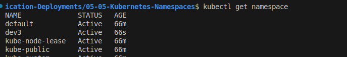
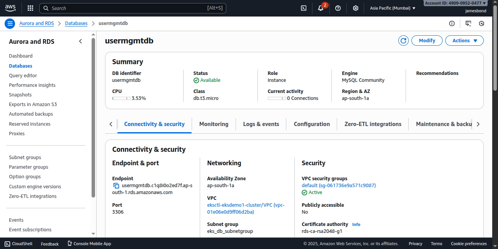
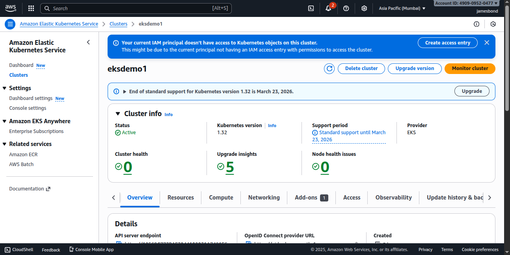
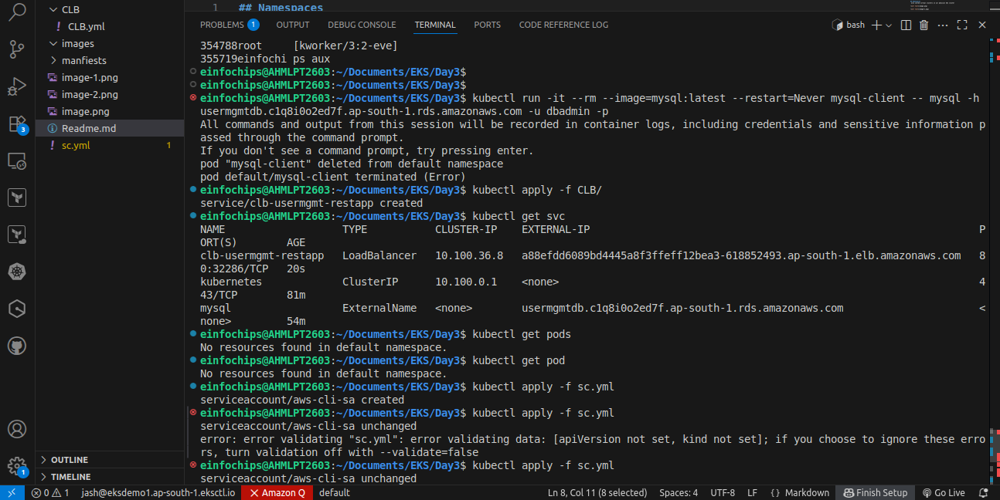
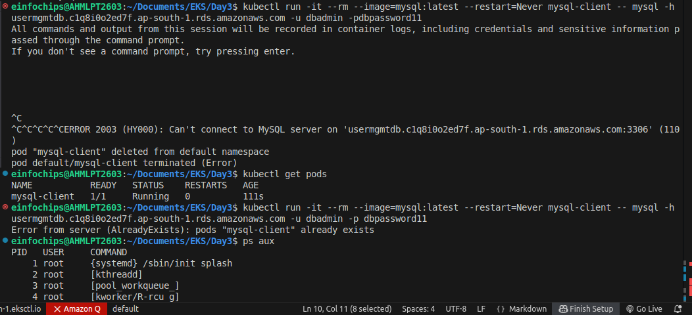
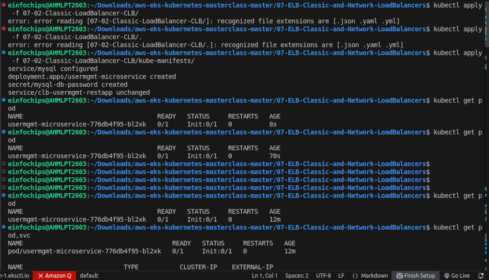
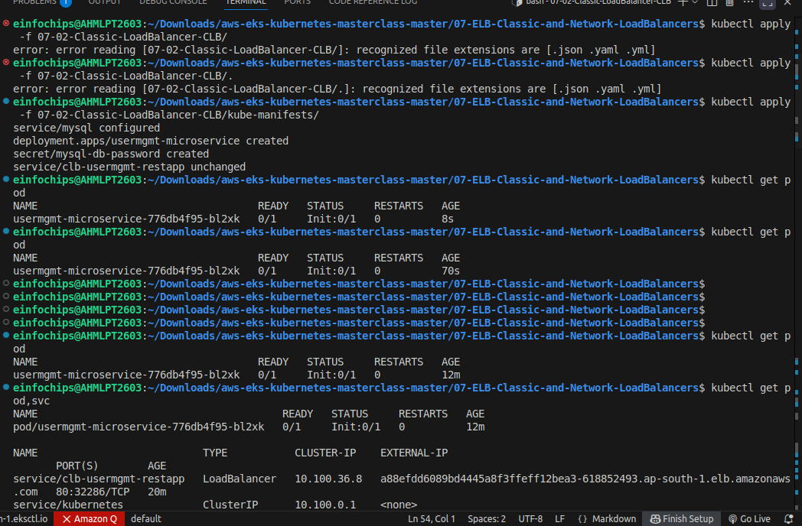
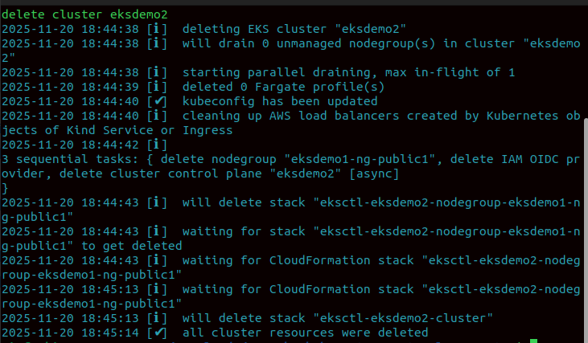

# Kubernetes Core Concepts – Detailed README

## 1. Namespaces
A namespace is a logical partition inside a Kubernetes cluster. It helps separate and organize workloads. You can think of a namespace like a folder on your computer.

### Why Namespaces Are Used
- Separate environments (dev, stage, prod)
- Separate teams or projects
- Apply resource limits like CPU and Memory
- Apply network policies
- Improve security and isolation

### Example: Creating a Namespace
```yaml
apiVersion: v1
kind: Namespace
metadata:
  name: dev
```

- 1st class (namespace: dev)

- 2nd class (namespace: test)

- 3rd class (namespace: prod)

Each classroom has:

its own students (pods)

its own rules (limits)

its own teaching material (configmaps, secrets)




### What is LimitRange?

LimitRange sets default CPU/Memory requests & limits per Pod or container inside a namespace.

```bash
apiVersion: v1
kind: LimitRange
metadata:
  name: cpu-mem-limits
  namespace: dev
spec:
  limits:
    - type: Container
      min:
        cpu: 100m
        memory: 128Mi
      max:
        cpu: 2
        memory: 1Gi
      default:
        cpu: 500m
        memory: 256Mi
      defaultRequest:
        cpu: 200m
        memory: 128Mi
```
ResourceQuota

A ResourceQuota restricts how much total resource a namespace can use.

```bash

apiVersion: v1
kind: ResourceQuota
metadata:
  name: dev-quota
  namespace: dev
spec:
  hard:
    pods: "20"
    requests.cpu: "4"
    limits.cpu: "10"
    requests.memory: "8Gi"
    limits.memory: "16Gi"
```

Requests and Limits

These define how much minimum and maximum resource a container can use.

Requests

The minimum guaranteed CPU/Memory a container will receive.

Limits

The maximum CPU/Memory a container is allowed to use.

```bash

resources:
  requests:
    cpu: "200m"
    memory: "256Mi"
  limits:
    cpu: "500m"
    memory: "512Mi"


```

## AWS Load Balancers in EKS

# CLB & NLB














## Clean-Up



