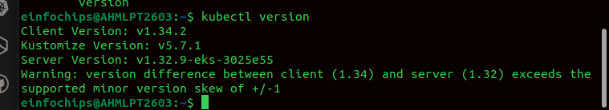
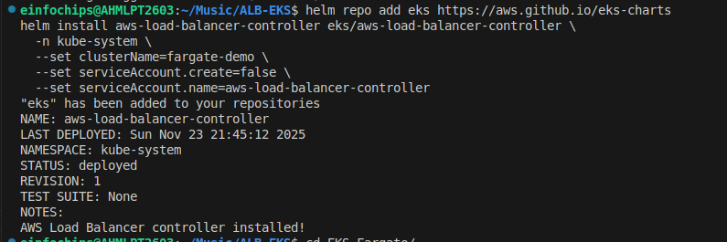

## Integrate Application Load Balancer with AWS EKS Using AWS Load Balancer Controller




ALB Ingress Controller

In Kubernetes, an Ingress is a resource that exposes HTTP/HTTPS routes from outside the cluster to services inside the cluster.

AWS provides the ALB Ingress Controller (now called AWS Load Balancer Controller) that automatically provisions an Application Load Balancer (ALB) in front of your Kubernetes services when you create an Ingress.
Prerequisites


    An EKS cluster.
    At least two subnets in different Availability Zones (AZs) with the appropriate tags:

    For public subnets (for internet-facing load balancers):
    Tag: kubernetes.io/role/elb
    Value: 1 or <empty>
    For private subnets (for internal load balancers):
    Tag: kubernetes.io/role/internal-elb
    Value: 1 or <empty>

IAM Permissions

You need to set up IAM permissions to allow the AWS Load Balancer Controller to manage ALB resources. There are two ways to set up IAM permissions: using IAM roles for ServiceAccounts or attaching IAM policies directly to the worker node IAM roles.

Using IAM roles for ServiceAccounts (recommended)

Create an IAM OIDC provider for your EKS cluster:

```bash
eksctl utils associate-iam-oidc-provider \
    --region <region-code> \
    --cluster <your-cluster-name> \
    --approve
```

Download the IAM policy for the AWS Load Balancer Controller

```bash
curl -o iam-policy.json https://raw.githubusercontent.com/kubernetes-sigs/aws-load-balancer-controller/v2.2.1/docs/install/iam_policy.json
```

Create an IAM policy called AWSLoadBalancerControllerIAMPolicy

```bash
aws iam create-policy \
    --policy-name AWSLoadBalancerControllerIAMPolicy \
    --policy-document file://iam-policy.json
```

Create an IAM role and ServiceAccount for the AWS Load Balancer Controller, using the ARN from the previous step

```bash
eksctl create iamserviceaccount \
    --cluster=<your-cluster-name> \
    --namespace=kube-system \
    --name=aws-load-balancer-controller \
    --attach-policy-arn=arn:aws:iam::<YOUR_AWS_ACCOUNT_ID>:policy/AWSLoadBalancerControllerIAMPolicy \
    --override-existing-serviceaccounts \
    --approve
```

Add the Controller to the Cluster via Helm

Add the EKS chart repo to Helm

```bash
helm repo add eks https://aws.github.io/eks-charts
```

Install the necessary CRDs (Custom Resource Definitions) for the AWS Load Balancer Controlle

```bash
kubectl apply -k "github.com/aws/eks-charts/stable/aws-load-balancer-controller//crds?ref=master"
```
Install the AWS Load Balancer Controller using Helm. If you’re using IAM roles for service accounts, make sure to specify the appropriate values

```bash
helm install aws-load-balancer-controller eks/aws-load-balancer-controller -n kube-system --set clusterName=<your-cluster-name> --set serviceAccount.create=false --set serviceAccount.name=aws-load-balancer-controller
```




Deploy a Application

To verify that the AWS Load Balancer Controller is working correctly and creates an ALB, follow these steps:

Create a deployment for the sample application. Save the following YAML to a file named deployment.yaml

```bash
apiVersion: apps/v1
kind: Deployment
metadata:
  name: nginx-app
spec:
  selector:
    matchLabels:
      run: nginx-app
  replicas: 1
  template:
    metadata:
      labels:
        run: nginx-app
    spec:
      containers:
      - name: nginx-app
        image: nginx
        ports:
        - containerPort: 80
```

Apply the deployment:

```bash
kubectl apply -f deployment.yaml
```

Create a service for the sample application. Save the following YAML to a file named service.yaml

```bash
apiVersion: v1
kind: Service
metadata:
  name: nginx-svc
  labels:
    run: nginx-app
spec:
  ports:
  - port: 80
    protocol: TCP
  selector:
    run: nginx-app
```

Apply the service:

```bash
kubectl apply -f service.yaml
```

Create an ingress for the sample application. Save the following YAML to a file named ingress.yaml

```bash
apiVersion: networking.k8s.io/v1
kind: Ingress
metadata:
  name: app-ingress
  annotations:
    alb.ingress.kubernetes.io/scheme: internet-facing
    alb.ingress.kubernetes.io/target-type: ip
spec:
  ingressClassName: alb
  rules:
    - http:
        paths:
          - path: /
            pathType: Prefix
            backend:
              service:
                name: nginx-svc
                port:
                  number: 80
```
apply the ingress

```bash
kubectl apply -f ingress.yaml
```


Name-Based Virtual Hosting

Virtual hosting allows a single ALB to host multiple domains or subdomains.

Name-based virtual host means routing traffic to different Kubernetes services based on the hostname in the HTTP request.

```bash
apiVersion: networking.k8s.io/v1
kind: Ingress
metadata:
  name: my-ingress
  annotations:
    alb.ingress.kubernetes.io/scheme: internet-facing
spec:
  rules:
    - host: frontend.example.com
      http:
        paths:
          - path: /
            pathType: Prefix
            backend:
              service:
                name: frontend-service
                port:
                  number: 80
    - host: backend.example.com
      http:
        paths:
          - path: /
            pathType: Prefix
            backend:
              service:
                name: backend-service
                port:
                  number: 80

```

Key Points

One ALB can handle multiple domains using name-based virtual hosts.

Requires the host field in the Ingress rules.

The ALB listens on port 80/443 and routes traffic based on host + path rules.

Can be combined with path-based routing for even finer-grained traffic co

