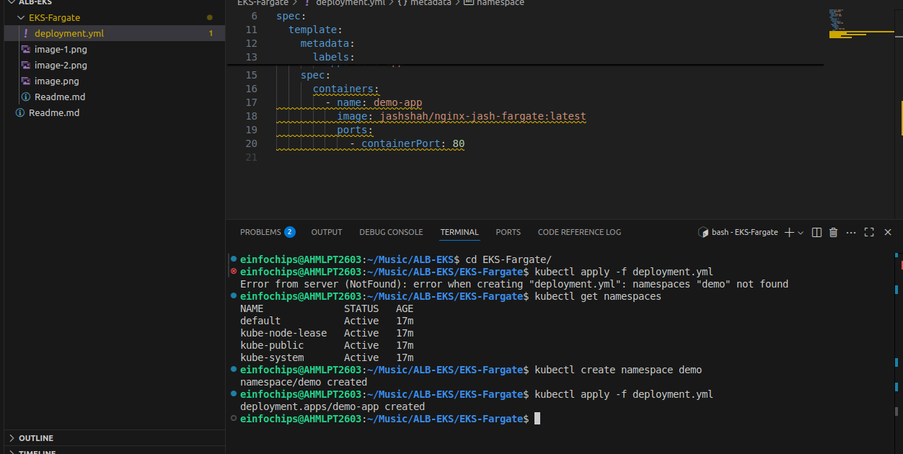
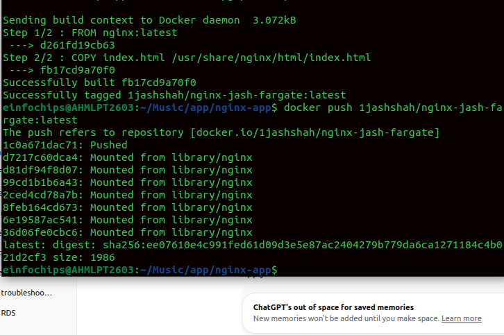
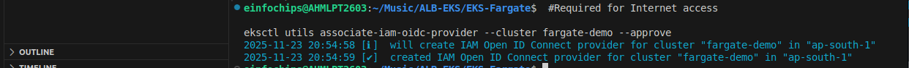
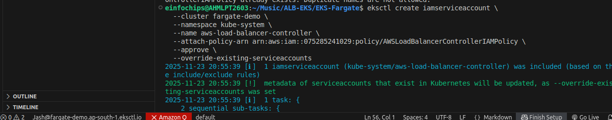
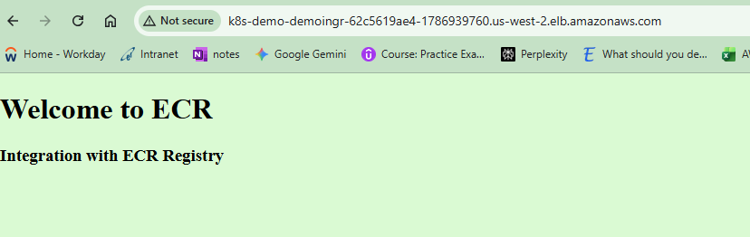

### Web Application on Amazon EKS Fargate with Public Access via ALB Ingress

```bash
eksctl create cluster \
  --name fargate-demo \
  --region us-west-2 \
  --fargate
  ```


kubectl create namespace demo






create deployment

```bash
apiVersion: apps/v1
kind: Deployment
metadata:
  name: demo-app
  namespace: demo
spec:
  replicas: 1
  selector:
    matchLabels:
      app: demo-app
  template:
    metadata:
      labels:
        app: demo-app
    spec:
      containers:
        - name: demo-app
          image: jashshah/nginx-jash-fargate:latest
          ports:
            - containerPort: 80
```
kubectl apply -f deploy-app.yaml


```bash
service.yaml
apiVersion: v1
kind: Service
metadata:
  name: demo-service
  namespace: demo
spec:
  type: ClusterIP
  selector:
    app: demo-app
  ports:
    - port: 80
      targetPort: 80
```
```bash
kubectl apply -f service.yaml
```

service created

Install AWS ALB Ingress Controller

```bash
 #Required for Internet access

eksctl utils associate-iam-oidc-provider --cluster fargate-demo --approve
```

IAM policy
```bash
curl -o alb-iam-policy.json https://raw.githubusercontent.com/kubernetes-sigs/aws-load-balancer-controller/main/docs/install/iam_policy.json

```

role and service accont
eksctl create iamserviceaccount \
  --cluster fargate-demo \
  --namespace kube-system \
  --name aws-load-balancer-controller \
  --attach-policy-arn arn:aws:iam::075285241029:policy/AWSLoadBalancerControllerIAMPolicy \
  --approve \
  --override-existing-serviceaccounts




ALB controller

```bash
apiVersion: networking.k8s.io/v1
kind: Ingress
metadata:
  name: demo-ingress
  namespace: demo
  annotations:
    alb.ingress.kubernetes.io/scheme: internet-facing
    alb.ingress.kubernetes.io/target-type: ip
spec:
  ingressClassName: alb
  rules:
    - http:
        paths:
          - path: /
            pathType: Prefix
            backend:
              service:
                name: demo-service
                port:
                  number: 80
```




