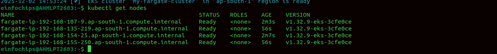
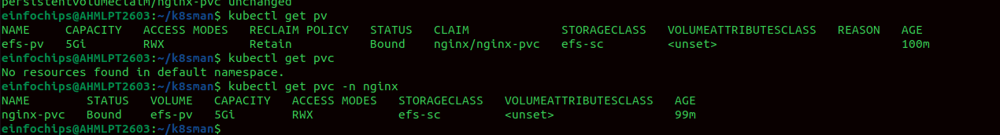

Create an EKS Cluster with Fargate
With Fargate, you don’t need EC2 nodes, so we can create a cluster that runs entirely serverless.

```bash
eksctl create cluster \
  --name my-fargate-cluster \
  --region us-east-1 \
  --fargate
```

```bash
 eksctl utils associate-iam-oidc-provider   --region ap-south-1   --cluster fargate-cluster   --approve
```

create Fargate Profile

```bash
 eksctl create fargateprofile   --cluster fargate-cluster   --region ap-south-1   --name fargate-nginx   --namespace nginx

```

Install CSI-Driver

```bash
helm repo add aws-efs-csi-driver https://kubernetes-sigs.github.io/aws-efs-csi-driver/
helm repo update
helm install aws-efs-csi-driver   aws-efs-csi-driver/aws-efs-csi-driver   --namespace kube-system

```


kubectl get nodes




create EFS

```bash
aws efs create-file-system \
  --region ap-south-1 \
  --performance-mode generalPurpose
```
and EFS Access point

```bash

aws efs create-access-point \
  --file-system-id fs-0c489e976489de744 \
  --posix-user Uid=1000,Gid=1000 \

```
Storage-class

A StorageClass in Kubernetes defines how dynamic storage (PersistentVolumes) should be created in the cluster, including:

Which storage provider to use (AWS EBS, GP3, SSD, HDD, NFS, etc.)

What type of disk

Size, IOPS, throughput

Reclaim policy

Binding mode

It is basically a template for creating PersistentVolumes automatically.

create efs-sc.yml
```bash
apiVersion: storage.k8s.io/v1
kind: StorageClass
metadata:
  name: efs-sc
provisioner: efs.csi.aws.com
---
apiVersion: v1
kind: PersistentVolume
metadata:
  name: efs-pv
spec:
  capacity:
    storage: 5Gi
  volumeMode: Filesystem
  accessModes:
    - ReadWriteMany
  persistentVolumeReclaimPolicy: Retain
  storageClassName: efs-sc
  csi:
    driver: efs.csi.aws.com
    volumeHandle: fs-0c489e976489de744::fsap-0bbc371e61a11c38c
---
apiVersion: v1
kind: PersistentVolumeClaim
metadata:
  name: nginx-pvc
  namespace: nginx
spec:
  accessModes:
    - ReadWriteMany
  storageClassName: efs-sc
  resources:
    requests:
      storage: 5Gi
```


