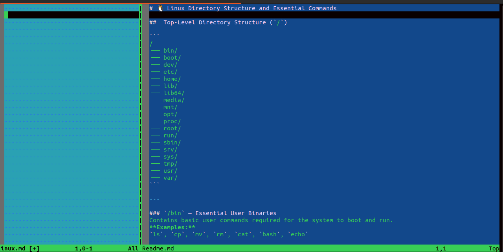
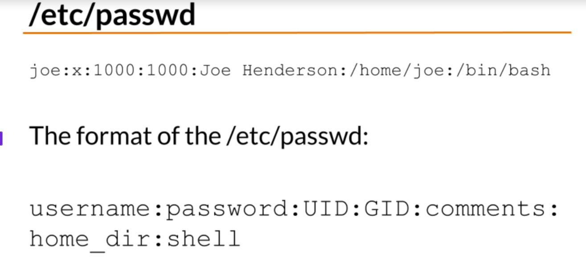

#  Linux Essentials and Administration Guide

This README covers essential Linux commands and concepts including file operations, environment variables, process management, networking, package management, disk management, and LVM.

---

## File Comparison and Viewing Commands

### 🔹 diff Command
Compares two files line by line and shows the differences.
```bash
diff file1.txt file2.txt
```

### 🔹 vimdiff Command
Compare files directly inside the `vim` editor.
```bash
vimdiff file1.txt file2.txt
```


### 🔹 file Command
Check the type of a file.
```bash
file <filename>
```

---

##  Aliases in Linux

Aliases are shortcuts for commands.

Example:
```bash
alias clr="clear"
```

### 🔹 Make Aliases Permanent
Aliases defined in the terminal last only for the current session.

To make them permanent:
```bash
nano ~/.bashrc
```

Add your aliases at the bottom:
```bash
alias ll='ls -la'
alias update='sudo apt update && sudo apt upgrade -y'
alias cls='clear'
```

Save and apply changes:
```bash
source ~/.bashrc
```

---
##  Environment Variables

### 🔹 Viewing All Environment Variables
```bash
printenv
printenv PATH
```

### 🔹 Setting Environment Variables
Temporary variable for current session:
```bash
export VAR=value
```

### 🔹 Unsetting (Deleting) a Variable
```bash
unset VARIABLE_NAME
```

---

## Process Management

### 🔹 View All Processes
```bash
ps aux
```

### 🔹 Foreground Process
Runs directly in your terminal.
```bash
ping google.com
```

### 🔹 Background Process


Run without blocking the terminal.
```bash
ping google.com &
jobs
fg %1
Ctrl + Z
bg %1
ps
kill %1
```

### 🔹 Process Tree
```bash
pstree
```

---

## Command History

### 🔹 View History
```bash
history
```

### 🔹 Re-run a Command by Number
```bash
!3
```

### 🔹 Clear Command History
```bash
history -c
```

---

## Pipes and Redirection

Send output of one command to another.
```bash
command1 | command2
```

Example:
```bash
cat file.txt | grep "error"
```

---

##  File Transfer Commands

### 🔹 SCP (Secure Copy)
```bash
scp /home/jash/test.txt ubuntu@192.168.1.10:/home/ubuntu/
scp -r /home/jash/myfolder ubuntu@192.168.1.10:/home/ubuntu/
```

### 🔹 SFTP (Secure File Transfer)
```bash
sftp ubuntu@192.168.1.10
sftp> get data.csv
```

### 🔹 FTP (File Transfer Protocol)
Older and unencrypted; use for public servers only.

---

## APT and DPKG (Package Management)

### 🔹 APT Commands
```bash
sudo apt update        # Update package list
sudo apt upgrade       # Upgrade all packages
sudo apt search <pkg>  # Search for a package
sudo apt install <pkg> # Install a package
sudo apt purge <pkg>   # Remove a package
sudo apt autoremove    # Remove unused packages
```

### 🔹 DPKG Commands
```bash
dpkg -l                 # List all installed packages
dpkg -L <packagename>   # List all files in a package
dpkg -i <package.deb>   # Install a .deb file
```

---

## Disk Management in Linux

Disk management involves managing storage devices, partitions, and file systems.

### 🔹 Identify Disks and Partitions
```bash
lsblk
sudo fdisk -l
```

### 🔹 Mounting a Disk
```bash
sudo mkdir /mnt/data
sudo mount /dev/sdb1 /mnt/data
```

---

##  LVM (Logical Volume Manager)

LVM allows flexible management of disk storage.

### 🔹 Concept
| Layer | Description |
|--------|-------------|
| PV | Physical Volume – actual disk partitions (/dev/sdb1) |
| VG | Volume Group – combined storage pool |
| LV | Logical Volume – mountable storage (like /home, /data) |

### 🔹 Commands
```bash
sudo pvcreate /dev/sdb1
sudo vgcreate my_vg /dev/sdb1 /dev/sdc1
sudo lvcreate -L 10G -n data_lv my_vg
sudo mkfs.ext4 /dev/my_vg/data_lv
sudo mount /dev/my_vg/data_lv /mnt/data
```

### 🔹 Extend Logical Volume
```bash
sudo lvextend -L +5G /dev/my_vg/data_lv
sudo resize2fs /dev/my_vg/data_lv
```

---

##  Summary

| Category | Commands |
|-----------|-----------|
| Process | ps, fg, bg, jobs, kill |
| File Transfer | scp, sftp, ftp |
| Package Mgmt | apt, dpkg |
| Disk Mgmt | fdisk, lsblk, mount |
| LVM | pvcreate, vgcreate, lvcreate |
| Aliases | alias, ~/.bashrc |
| Environment | export, printenv, unset |


Usermanagement 



