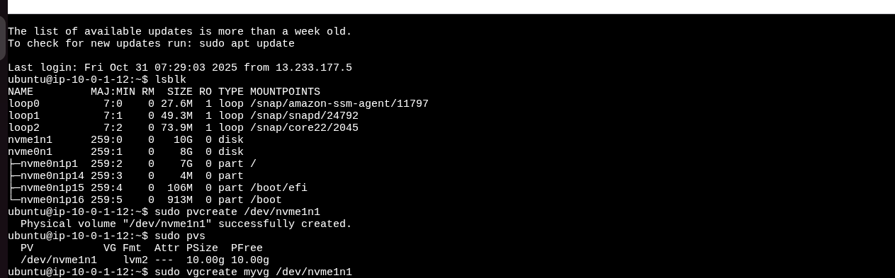
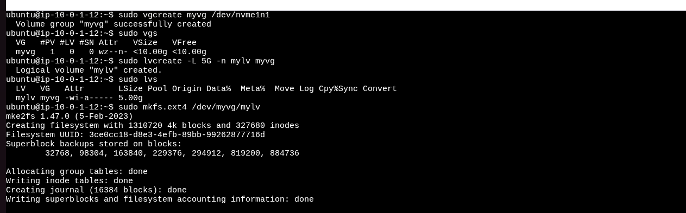
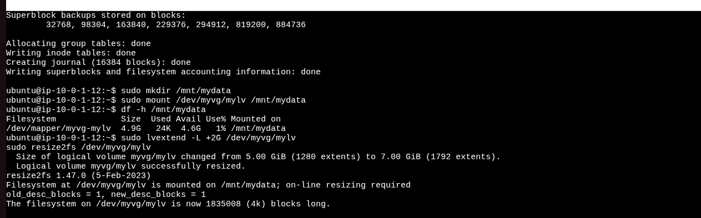
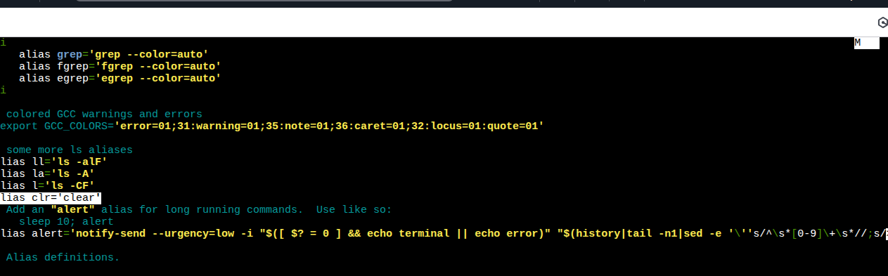

#  Linux Commands, Scripting, and System Administration Guide

This README contains explanations, usage, and examples of essential Linux commands and concepts related to networking, user management, LVM, disk management, and shell scripting.

---

## Networking Commands

### **1. traceroute**
**Usage:** Displays the route packets take to reach a network host.
```bash
traceroute google.com
```
**Example Output:**
Shows each hop from your computer to Google’s server with latency per hop.

---

### **2. netstat**
**Usage:** Displays network connections, routing tables, interface statistics, etc.
```bash
netstat -tulnp
```
**Example:** Lists all active TCP/UDP connections and listening ports.

---

### **3. tcpdump**
**Usage:** Captures and analyzes network packets.
```bash
sudo tcpdump -i eth0
```
**Example:** Displays live packet capture on interface eth0.

---

### **4. telnet**
**Usage:** Tests connectivity to a specific port or host.
```bash
telnet google.com 80
```
**Example:** Checks if a remote web server is reachable on port 80.

---

## Permissions: setuid and setgid

- **setuid (Set User ID):** Allows users to run a file with the permissions of the file owner.
- **setgid (Set Group ID):** Allows files to run with the permissions of the file’s group.

**Example:**
```bash
chmod u+s /usr/bin/passwd   # Enables setuid
chmod g+s /shared/folder    # Enables setgid
```

---

## Shebang Line

### **#!/bin/bash**
Specifies which interpreter should execute the script.

**Example:**
```bash
#!/bin/bash
echo "Hello, Linux!"
```

---

## Shell Scripting Basics

### **Valid Variable Names**
- Must start with a **letter or underscore**.
- Can contain **letters, numbers, and underscores**.
- No spaces or special characters.

**Example:**
```bash
my_var="Linux"
echo $my_var
```

---

### **Positional Parameters**
Used to access command-line arguments passed to a script.

**Example:**
```bash
#!/bin/bash
echo "First argument: $1"
echo "Second argument: $2"
```
Run:
```bash
./script.sh hello world
```
Output: `First argument: hello`, `Second argument: world`

---

### **Loops and Conditionals**

**For Loop Example:**
```bash
for i in 1 2 3; do
  echo "Number $i"
done
```

**If-Else Example:**
```bash
if [ $1 -gt 10 ]; then
  echo "Greater than 10"
else
  echo "Less than or equal to 10"
fi
```

---

## Bash History Expansion

| Command | Description |
|----------|--------------|
| `!u` | Runs the last command starting with `u` |
| `ls !*` | Reuses all arguments from the previous command |
| `!$` | Reuses the last argument from the previous command |
| `su -c "!!"` | Runs the previous command as superuser |

---

## systemd

**systemd** is the system and service manager for Linux. It manages:
- System startup and shutdown
- Background services (daemons)
- Logging and targets

**Common Commands:**
```bash
systemctl start sshd
systemctl enable nginx
systemctl status docker
```

---

## Connecting to a VM via Network

To connect from a host machine:
```bash
ssh username@<VM_IP_Address>
```
If using AWS EC2:
```bash
ssh -i key.pem ubuntu@<public-ip>
```

Ensure **port 22** is open and **sshd** service is running.

---

## sshd (SSH Daemon)
- **Service responsible for managing SSH connections.**  
- Runs on port 22 by default.

**Commands:**
```bash
sudo systemctl start sshd
sudo systemctl enable sshd
sudo systemctl status sshd
```

---

## LVM and Disk Management

**Create Physical Volume (PV):**

```bash
sudo pvcreate /dev/nvme1n1
sudo pvs
```


**Create Volume Group (VG):**
```bash
sudo vgcreate myvg /dev/nvme1n1
sudo vgs
```


** Create Logical Volume (LV):**
```bash
sudo lvcreate -L 5G -n mylv myvg
sudo lvs
```


**Format and Mount:**
```bash
sudo mkfs.ext4 /dev/myvg/mylv
sudo mkdir /mnt/mydata
sudo mount /dev/myvg/mylv /mnt/mydata
```



** Make Mount Permanent:**
Add entry in `/etc/fstab` using UUID.

**Extend LV:**
```bash
sudo lvextend -L +2G /dev/myvg/mylv
sudo resize2fs /dev/myvg/mylv
```

---


(Optional) Extend the Volume Later
If you want to extend your LV:

```bash
sudo lvextend -L +2G /dev/myvg/mylv
sudo resize2fs /dev/myvg/mylv
```

##  User and Group Management

| Task | Command | |
|------|----------|----------|
| Create user | `sudo useradd` | `sudo useradd jash` |
| Set password | `sudo passwd` | `sudo passwd jash` |
| Create group | `sudo groupadd` | `sudo groupadd devops` |
| Add user to group | `sudo usermod -aG` | `sudo usermod -aG devops jash` |
| Delete user | `sudo userdel` | `sudo userdel jash` |
| View users | `cat /etc/passwd` | — |
| View groups | `cat /etc/group` | — |

---

## grep Command

**Usage:** Search for text or patterns in files.
```bash
grep "import" *.py
```
**Example:** Finds all files containing the word "import".

grep ‘[fever]’ leave.txt
grep ‘[[:upper:]]’ leave.txt
Grep ‘leave’ * → searches leave word in all the file of the directory


---

## Clear and Permanent Alias

**Create a temporary alias:**
```bash
alias cls='clear'
```


**Make alias permanent:**
Add it to `~/.bashrc` or `~/.bash_profile`:
```bash
echo "alias cls='clear'" >> ~/.bashrc
source ~/.bashrc
```

---

---

