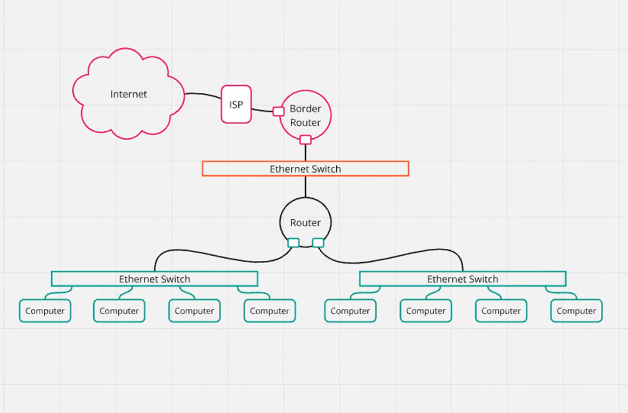

# Networking

## OSI (Open Systems Interconnection) Model

------------------------------------------------------------------------

# Layer 1 - Physical Layer

**What it does:**

-   Deals with physical signals (electrical pulses, light, radio waves).
-   Defines cables, connectors, voltages, frequencies.

**Real Example:**

-   LAN cable (RJ45), Wi-Fi signals, fiber cables.
-   Like the road used for transporting goods.

**Hub: Works on Physical Layer**

Old computer labs used hubs:

-   10--20 PCs connected with RJ45 cables
-   If one PC sends data, all PCs receive it → congestion
-   Hub broadcasts data to every device

------------------------------------------------------------------------

# Layer 2 - Data Link Layer

A **MAC Address** is a permanent hardware identifier assigned by the NIC
manufacturer.

-   Works inside the local network
-   Used for communication at Layer 2
-   Unique for each device

**Responsibilities:**

-   Organizes data into frames
-   Handles MAC addressing, switching, error detection
-   Node-to-node delivery

### Frame Structure:

-   Source MAC\
-   Destination MAC\
-   Payload\
-   Error-checking bits (CRC)

------------------------------------------------------------------------

## Switch

A switch sends data **only to the intended device**, unlike a hub.

### Switch MAC Table (CAM Table)

  MAC Address   Port
  ------------- ------
  A1:B2:C3:D4   1
  D2:E3:F4:G5   2
  91:AC:77:FA   5

### How Switch Works

1.  Device sends frame\
2.  Switch reads **source MAC** → learns which device is on which port\
3.  Switch checks **destination MAC**

Cases:

-   **Known MAC → Unicast** → send to specific port\
-   **Unknown MAC → Flood** → send to all ports

Both hub & switch work in LAN.

------------------------------------------------------------------------

# Layer 3 - Network Layer

### IP Address

-   IPv4 → most common
-   IPv6 → solves IPv4 shortage

  Type         Usage             Example
  ------------ ----------------- --------------
  Public IP    Global Internet   103.21.45.89
  Private IP   Internal LAN      192.168.1.10

Private IPs are not routable on the internet.\
Routers use NAT to map private → public.

------------------------------------------------------------------------

## Subnet

A subnetwork inside a larger network.

Used for:

-   Traffic management
-   Security
-   Efficient IP allocation

------------------------------------------------------------------------

## Router

A router connects different networks and forwards packets between them.

Works at **Layer 3**.

------------------------------------------------------------------------

## Multicast

Used when one sender sends data to multiple specific receivers.

Examples:

-   IPTV / Live streaming
-   Online meetings
-   Stock market feeds
-   Multiplayer gaming
-   Routing protocols (OSPF, EIGRP, PIM)

------------------------------------------------------------------------

## Ping & ICMP

Ping uses ICMP Echo Request/Reply.

**ICMP uses:**

-   Destination unreachable\
-   Time exceeded\
-   Diagnostics

------------------------------------------------------------------------

# Layer 4 - Transport Layer

Ensures end-to-end data delivery.

------------------------------------------------------------------------

## TCP (Transmission Control Protocol)

-   Reliable
-   Connection-oriented
-   Uses **3-way handshake**

### 3-Way Handshake

1.  SYN
2.  SYN-ACK
3.  ACK

Used for:

-   HTTP/HTTPS
-   FTP
-   Email protocols

------------------------------------------------------------------------

## UDP (User Datagram Protocol)

-   Unreliable
-   Connectionless
-   No retransmissions
-   Faster

Used for:

-   Voice/video calls
-   Gaming
-   Streaming

------------------------------------------------------------------------

# Packet Walk

Step-by-step flow of data:

1.  PC creates packet → adds IP + MAC\
2.  Frame sent to switch\
3.  Switch forwards using MAC table\
4.  Router routes packet if different subnet\
5.  Destination PC processes packet

------------------------------------------------------------------------

# VLAN (Virtual LAN)

Logically divides a switch into separate networks.

Example:

-   VLAN 10 → HR\
-   VLAN 20 → Sales\
-   VLAN 30 → IT

Different VLANs require a router for communication (Inter-VLAN routing).

------------------------------------------------------------------------

# Layer 5 - Session Layer

Manages sessions (conversations) between applications.

Examples:

-   Remote desktop
-   Logins
-   File transfer
-   Video/Audio calls

------------------------------------------------------------------------

# Layer 6 - Presentation Layer

Responsible for data translation, formatting, and encryption.

Functions:

-   Encryption (SSL/TLS)
-   Compression (JPEG, MP4)
-   Encoding (ASCII, UTF-8)
-   Serialization (JSON, XML)

------------------------------------------------------------------------

# Layer 7 - Application Layer

Topmost layer.\
Provides interfaces used by applications.

Examples:

-   HTTP/HTTPS
-   DNS
-   FTP/SFTP
-   SMTP/IMAP/POP3
-   SSH/Telnet
-   SNMP
-   NFS/SMB

------------------------------------------------------------------------

# WAN (Wide Area Network)

Large network that connects multiple LANs.

# Internet

------------------------------------------------------------------------

# VPN (Virtual Private Network)

Creates a secure encrypted tunnel over the internet.

### Protocols:

  Protocol    Description
  ----------- ---------------------------
  IPSec       Used in site-to-site VPNs
  SSL/TLS     Browser-based VPNs
  OpenVPN     Secure and flexible
  WireGuard   Very fast and modern

------------------------------------------------------------------------

# Network Redundancy

Having backup paths/devices.

Benefits:

-   Minimizes downtime
-   Increases reliability
-   Supports load balancing

------------------------------------------------------------------------

# Layer 7 Firewall

Inspects traffic at application layer.

Can:

-   Block apps (YouTube, Netflix)
-   Inspect HTTPS/HTTP traffic
-   Detect malware

### NGFW = Layer 7 Firewall + Extras

Includes:

-   DPI
-   Application control
-   Threat intelligence
-   IDS/IPS

------------------------------------------------------------------------

# Subnetting

Dividing networks into smaller subnets.

### CIDR

Flexible IP allocation system.

**Formula:**

Usable hosts = 2\^(host bits) -- 2

Example:
Example 1: /24 subnet

CIDR = 192.168.1.0/24

Host bits = 32 − 24 = 8 bits

Number of hosts = 2^8 − 2 = 256 − 2 = 254 hosts
-   /24 → 254 hosts

