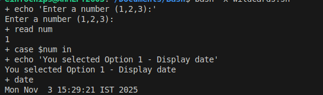

# Shell Scripting 

This document covers all the essential topics of **Shell Scripting**, including variables, conditionals, loops, functions, debugging, logging, wildcards, and more.

---

## Variables

A variable is a name given to a value (like a container that stores data).

### Declaring a Variable
```
variable_name=value
```
> No spaces before or after the `=` sign!

### Accessing Variables
Use `$` before the variable name:

```
echo $name
echo "My age is $age"
```

### Naming Conventions

- Must start with a letter or underscore
- Can contain letters, numbers, and underscores
- Cannot start with a number
- No spaces allowed

### Command Substitution

You can store command output inside a variable using backticks or `$( )`:


Example:
```
today=$(date)
echo "Today is $today"
```

### Readonly Variable

Once declared as readonly, it can’t be changed.

Example:
```
readonly company="OpenAI"
company="Google"   # Error
```

### Reading User Input into a Variable
```
echo "Enter your name: "
read username
echo "Welcome, $username!"
```

---

##  Environment Variables

These are global variables available to all programs and scripts.

To make your variable environmental:
```
export PATH=$PATH:/new/path
export USERNAME="Jash"
printenv
```

---

## If Else Statements


Example:
```
if [ -f /etc/passwd ]
then
  echo "File exists."
else
  echo "File not found."
fi
```

### File Test Operators

| Test | Description | Example |
|------|--------------|----------|
| -e | file exists | [ -e file.txt ] |
| -f | regular file exists | [ -f file.txt ] |
| -d | directory exists | [ -d /home/user ] |
| -r | file readable | [ -r file.txt ] |
| -w | file writable | [ -w file.txt ] |
| -x | file executable | [ -x script.sh ] |


### Arithmetic Comparisons

| Operator | Meaning | Example |
|-----------|----------|----------|
| -eq | equal to | [ $a -eq $b ] |
| -ne | not equal to | [ $a -ne $b ] |
| -gt | greater than | [ $a -gt $b ] |
| -lt | less than | [ $a -lt $b ] |
| -ge | greater or equal | [ $a -ge $b ] |
| -le | less or equal | [ $a -le $b ] |

---

## Loops


### For Loop Example
```
for i in 1 2 3 4 5
do
  echo "Number $i"
done
```

### While Loop Example
```
count=1
while [ $count -le 5 ]
do
  echo "Count: $count"
  ((count++))
done
```

---

##  Positional Parameters

Positional parameters are variables that hold arguments passed to a shell script from the command line.

| Variable | Meaning |
|-----------|----------|
| $0 | the script name (./script.sh) |
| $1 | first argument (arg1) |
| $2 | second argument (arg2) |
| $3 | third argument (arg3) |
| $@ | all arguments as separate |

Example:
```
#!/bin/bash
echo "Script name: $0"
echo "First argument: $1"
echo "All arguments: $@"
```

---

##  Reading Standard Input

```
read -p "Enter file name: " filename
echo "You entered: $filename"
```

---

## Return Codes & Exit Status

Every command executed in Linux returns an exit status code to indicate whether it succeeded or failed.

Exit status:
- **0** → Success
- **1–255** → Failure or specific error

Checking exit status using `$?`:

| Code | Meaning |
|------|----------|
| 0 | Success |
| 1 | General error |
| 2 | Misuse of shell builtins |
| 126 | Command found but not executable |
| 127 | Command not found |
| 128 | Invalid argument to exit |
| 130 | Script terminated by Ctrl+C |
| >128 | Command terminated by a signal |


---

## Shell Functions and Variable Scope

A function is a reusable block of code that performs a specific task.

### Function Syntax
```
function_name() {
  commands
}
```
```bash
#!/bin/bash

greet(){
    echo "enter the name $1"
}
greet() "jash"

```

### Example
```
greet() {
  echo "Hello, $1!"
}
greet "Jash"
```

### Variable Scope

- **Global Variables** — accessible anywhere
- **Local Variables** — exist only inside functions

Example:
```
name="Global Jash"

print_name() {
  local name="Local Jash"
  echo "Inside function: $name"
}

print_name
echo "Outside function: $name"
```

---

##  Wildcards

Wildcards are special characters used to match patterns of filenames or text.

| Wildcard | Meaning | Example |
|-----------|----------|----------|
| * | Matches zero or more characters | rm *.txt |
| ? | Matches exactly one character | ls file?.txt |
| [ ] | Matches any character inside brackets | ls file[1-3].txt |


---

##  Logging

Logging means writing output messages (info, warnings, errors, etc.) to a file, console, or both — so you can track what your script is doing.

Example:
```
logger "Script started successfully"
echo "$(date): Script executed" >> /var/log/myscript.log
```

---

##  Debugging in Shell Scripts

Debugging helps find where and why your script fails.

### Run in Debug Mode
```
bash -x script.sh
```

### Verbose Mode
```
bash -v script.sh
bash -e script.sh
```


### Manual Debugging with DEBUG variable
```
DEBUG=true
log_debug() {
  if [ "$DEBUG" = true ]; then
    echo "[DEBUG] $1"
  fi
}
log_debug "Starting process..."
```

---

##  sed — Stream Editor

`sed` is a command-line tool to find, replace, delete, or insert text.

Examples:

**Replace text:**
```
sed 's/jash/raj/' file.txt
```


**Replace in place:**
```
sed -i 's/jash/raj/' file.txt
```

**Delete a line:**
```
sed '/yash/d' file.txt
```

**Insert text before a line:**
```
sed '/yash/i\This line is inserted' file.txt
```

---

## Syslog

Syslog is a centralized logging system for Linux.

```
logger -p user.info "This is an info message"
logger -p user.error "This is an error message"
```

Logs are stored in `/var/log/syslog` or `/var/log/messages`.

---

## Summary

This covered:

- Variables & Environment Variables  
- If-Else Statements  
- Loops (for, while)  
- Positional Parameters  
- Exit Status Codes  
- Functions & Variable Scope  
- Wildcards  
- Logging & Debugging  
- Using `sed`  
- Syslog Logging  

---