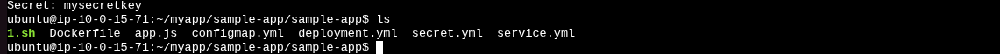
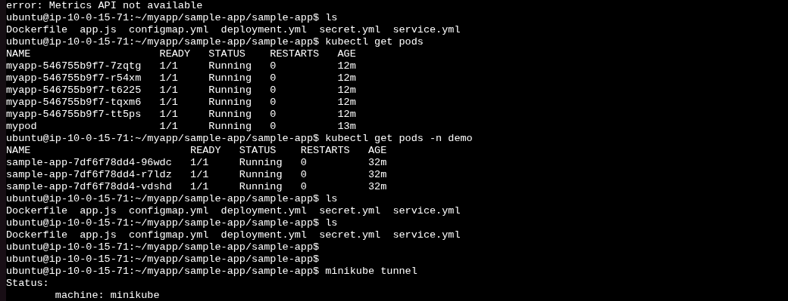
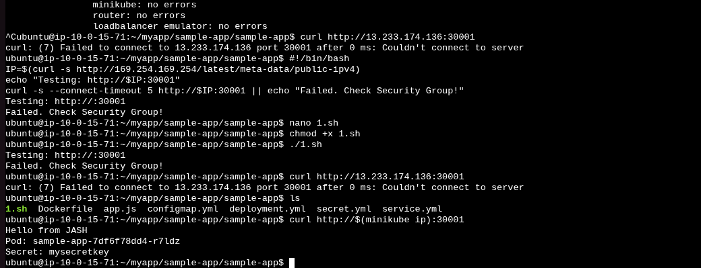
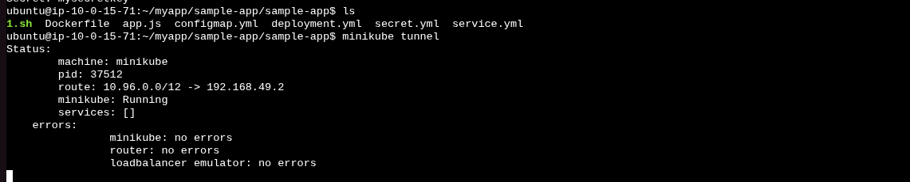

**Kubernetes** is an **open-source container orchestration platform**
that automates:

-   **Deployment** of applications (containers like Docker)

-   **Scaling** (adding/removing replicas automatically)

-   **Load balancing & service discovery**
    

-   **Self-healing** (restarts failed pods, reschedules on healthy nodes)

-   **Rolling updates & rollbacks**

-   **Storage orchestration**

### **Core Concepts**

-   **Pod** → Smallest deployable unit, usually runs one container.

-   **Node** → A worker machine (VM or physical server).

-   **Cluster** → A group of nodes controlled by a **control plane**.

-   **Deployment** → Defines how many replicas of a Pod you want.

-   **Service** → Exposes Pods to the network (ClusterIP, NodePort,
    > LoadBalancer).

-   **Ingress** → Routes external traffic to services using rules.

-   **ConfigMap/Secret** → Store configuration and sensitive data.

-   **Namespace** → Logical separation inside a cluster.

Using minikube
```bash
Kubectl get nodes
```


**K8s is written in YAML**

Creating first pod using yml

Pod definition file


Apply pod


```bash
Kubectl get pods
```


Other ways to create pods


Delete the pod


## **ReplicationController (RC)**

-   **One of the earliest controllers in Kubernetes**.

-   Ensures that a specified number of **Pod replicas** are always
    > running.

-   If a Pod crashes → RC creates a new one.

-   If someone manually creates an extra Pod with the same label → RC
    > kills it to maintain the desired count.

-   It is now deprecated

## **ReplicaSet (RS)**

-   **Newer and more powerful replacement for RC**.

-   Does everything RC does, but:\
    > Supports **set-based selectors** (in, notin, exists).\
    > Used by **Deployments** (whenever you create a Deployment, it
    > actually creates a ReplicaSet internally).

-   You usually **don't use ReplicaSet directly** → instead use a
    > Deployment for rolling updates, rollbacks
    command to scale (increase or decrease the replicaset)
     ```bash
    kubectl scale replicaset <replicaset-name> --replicas=2
     ```

## **template**

-   **Definition:** The template defines the **blueprint of Pods** that
    > the controller will create.

-   **Contents:** It includes:

    -   **metadata.labels** → labels assigned to the Pod.

    -   **spec** → container images, ports, environment variables, etc.

-   **Key point:** Every Pod created by the controller will follow this
    > template exactly.

## **selector**

-   **Definition:** The selector tells the controller **which Pods it should manage**.

-   **Key point:** The Pods that match the selector are the ones that count toward the replicas number.


**Important Rule:**

> The labels in the Pod template **must match** the selector. Otherwise,
> the controller won't recognize its own Pods.


**Deployment**

## **What is a Deployment?**

-   **A Deployment is a higher-level controller that manages
    ReplicaSets, which in turn manage Pods.

-   **It ensures that the desired number of Pods are running and
    > automates updates to your application.\

-   **Provides:**

    -   Rolling updates → update Pods gradually without downtime.
        

    -   **Rollbacks → revert to a previous version if something goes
        > wrong.

    -   Self-healing → restarts Pods if they crash.
       

    -   **Scaling → increase or decrease the number of replicas easily.**

## **Key Components**

1.  replicas → Number of Pods you want to run.

2.  selector → Defines which Pods belong to this Deployment.

3.  template → Blueprint for Pods (labels, containers, ports, etc.)

4.  strategy → How updates are applied (rolling or recreate)

**Why deployment \> replicasets**

**Because**

  ---------------------------------------------------------------------------
  **Deployment**   Manages ReplicaSets & Pods, provides updates, rollbacks,
                   scaling
  ---------------- ---------------------------------------------------------

  -----------------------------------------------------------------------
  **ReplicaSet**       **Ensures N Pods are running**
  -------------------- --------------------------------------------------


**Deployment -Update & Rollback**


**Option A**


**Option B**


**Apply the above deployment**

**Roll Back**


**Networking in k8s**


**What is a Service?**

A Service in Kubernetes is an abstraction that defines a logical set of
Pods and a policy to access them**.**

**Node Port**


**Cluster IP**

**Cluster ip is default service**

**Exposes the service internally only within the cluster.**

**Pods inside the cluster can communicate with it using ClusterIP or DNS
name.**


**A LoadBalancer Service is a type of Kubernetes Service that:**

1.  Exposes your Pods to external clients outside the cluster.

2.  Creates a cloud provider load balancer (AWS ELB, GCP LB, Azure LB) automatically.

3.  Forwards traffic from the LoadBalancer IP to the appropriate Pods in
    the cluster.

4.  Provides a stable external IP and abstracts the underlying Pod IPs,
    which can change


### Kubernetes Learning Lab on AWS EC2 with Minikube


First Install Docker


Install Minikube


Intall Kubectl


create or download your sample app


build & load your docker image 


create kubernetes resources


configmap.yml, secret.yml, deployment.yml, service.yml, 




deploy every resources





access the app via ec2 public ip


run minikube tunnel





